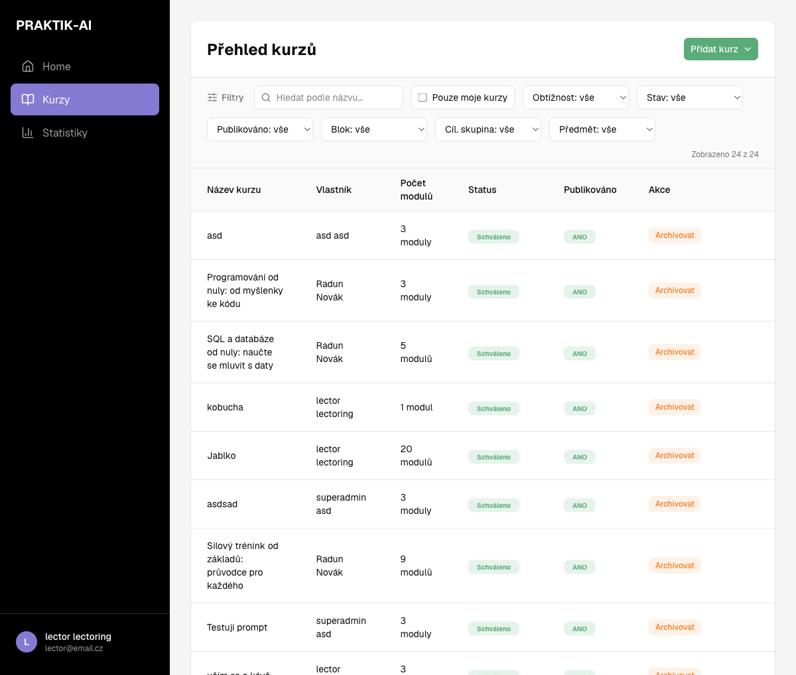
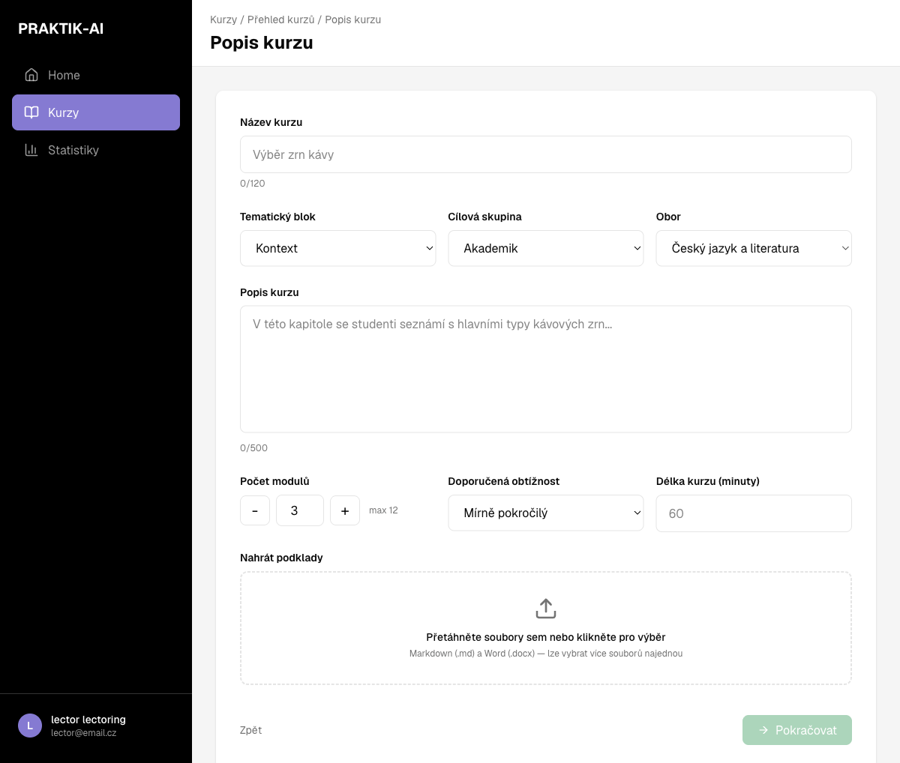
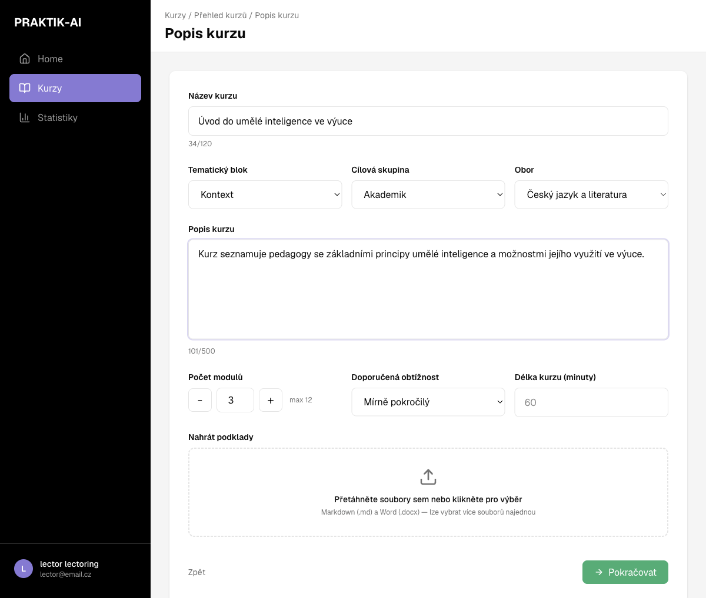
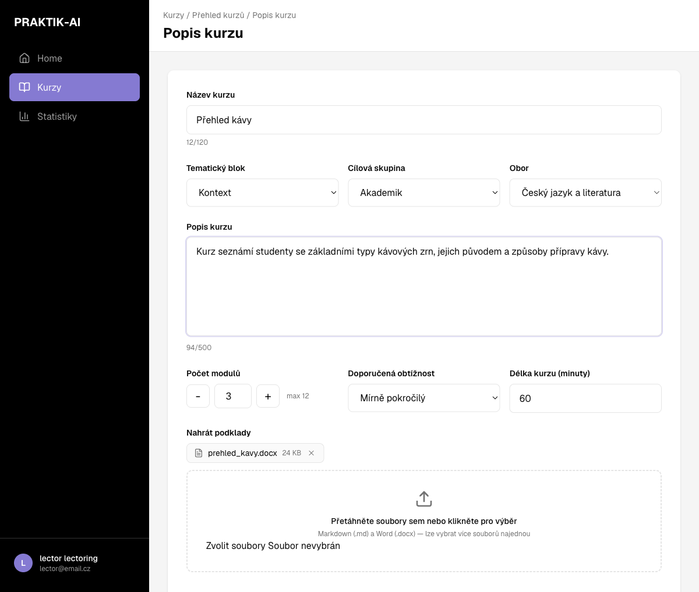
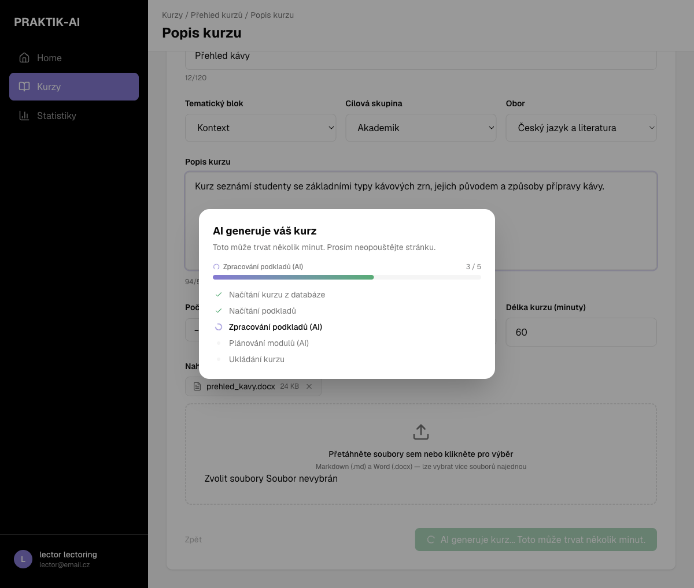
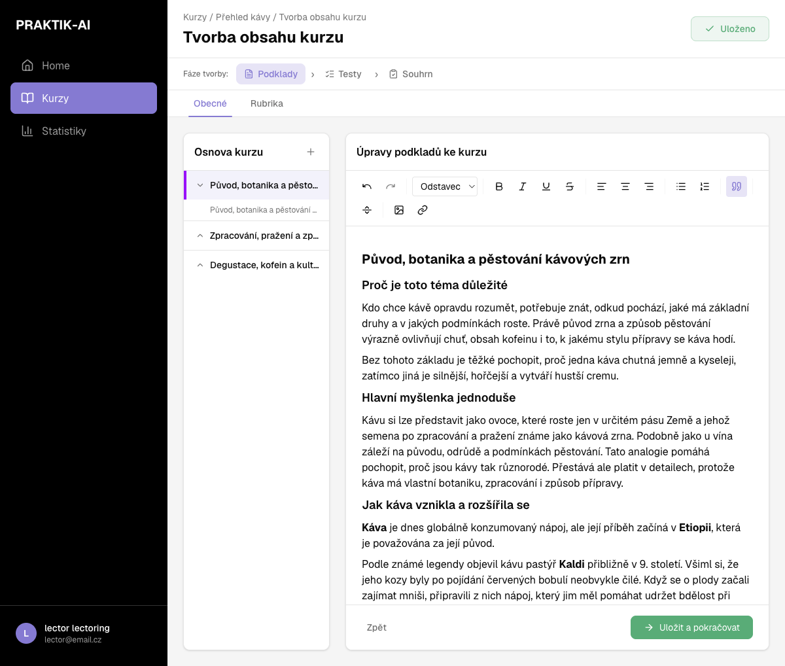
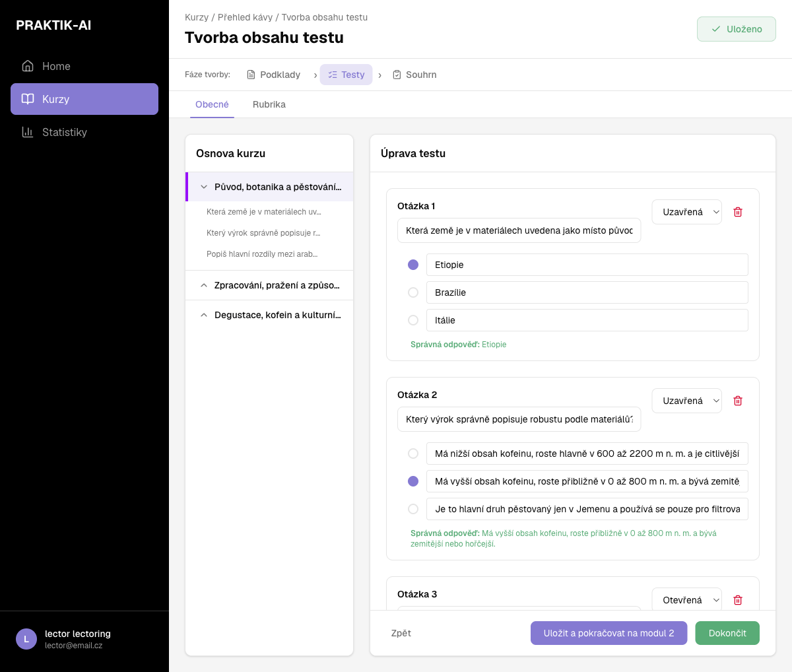
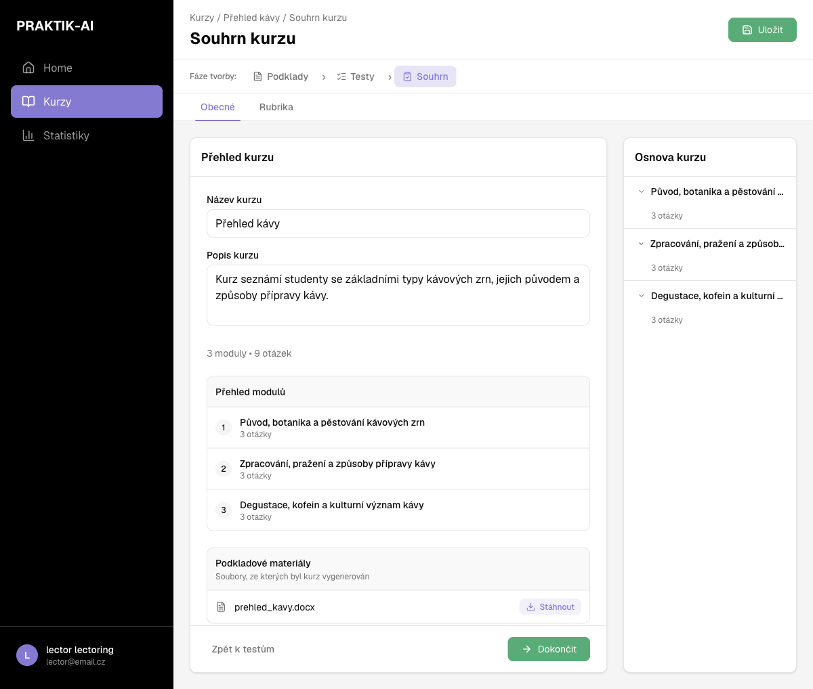
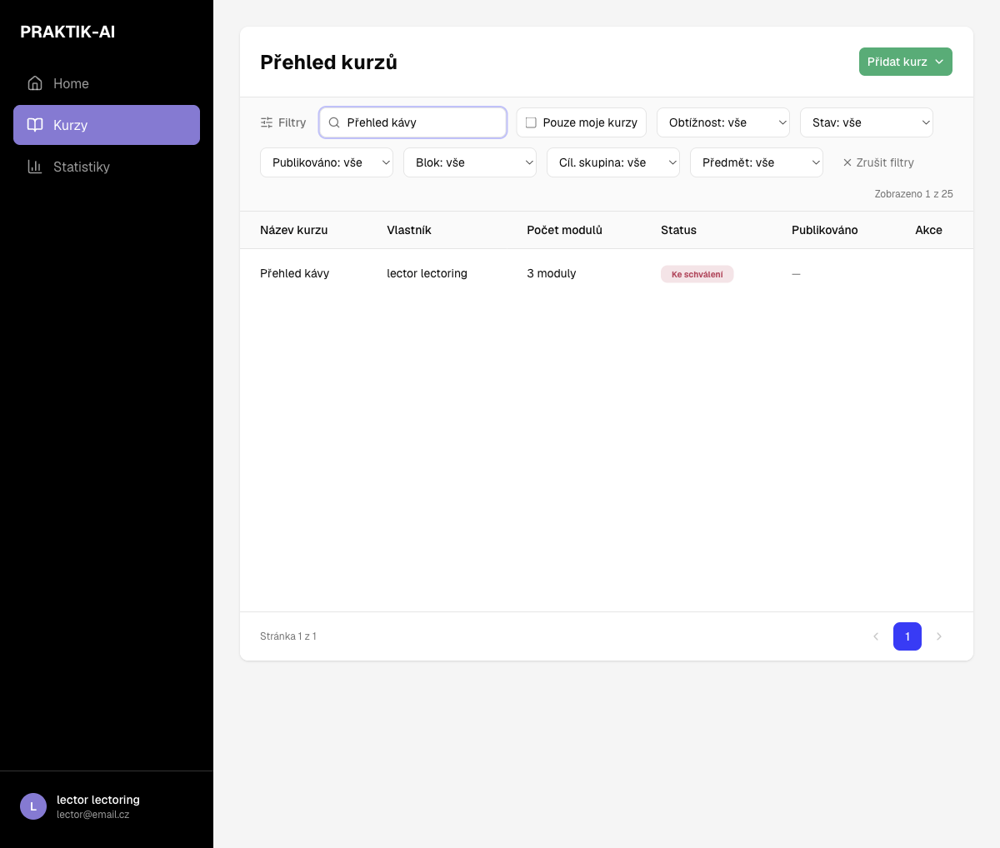

# Jak vytvořit kurz v Praktik-AI

## Úvod

Tato příručka popisuje, jak lektor v platformě **Praktik-AI** vytvoří nový kurz pomocí AI generování — od zadání tématu až po odeslání kurzu ke schválení garantovi.

Po projití příručky budete umět:

- otevřít administraci kurzů a zahájit tvorbu nového kurzu,
- vyplnit popis kurzu a volitelně nahrát podkladový materiál (.md nebo .docx),
- nechat AI vygenerovat osnovu, obsah modulů i procvičovací testy,
- upravit vygenerovaný obsah a testové otázky,
- zkontrolovat souhrn kurzu a odeslat ho ke schválení.

> Příklad v této příručce vychází z reálného průchodu na test prostředí (`test.praktik.ujep.cz`) s účtem s rolí **lector**, kde byl vytvořen ukázkový kurz „Přehled kávy" z nahraného dokumentu.

## Krok 1 — Otevřete administraci kurzů

Po přihlášení otevřete v levém menu položku **Kurzy** — dostanete se do administrace na adrese `/admin`. Zobrazí se **Přehled kurzů** se seznamem existujících kurzů; u každého je vidět vlastník, počet modulů, stav a dostupné akce, seznam lze filtrovat podle obtížnosti, stavu, bloku, cílové skupiny i předmětu. Vpravo nahoře klikněte na zelené tlačítko **Přidat kurz**.

Jediná aktuálně dostupná možnost v nabídce je **Pomocí AI** — kurz vznikne z vašeho zadání a nahraných podkladů, které AI zpracuje do hotové osnovy.

## Krok 2 — Vyplňte popis kurzu

Otevře se formulář **Popis kurzu**. Vyplňte:

- **Název kurzu** (max. 120 znaků),
- **Tematický blok** – Kontext / Transformace / Aplikace,
- **Cílovou skupinu** – Akademik / Student / Mentor / Host,
- **Obor**,
- **Popis kurzu** (max. 500 znaků) – stručně shrňte, co se studenti naučí,
- **Počet modulů** (max. 12), **doporučenou obtížnost** a **délku kurzu** v minutách.

Po vyplnění všech polí vypadá formulář například takto:

## Krok 3 — Nahrajte podkladové materiály

V sekci **Nahrát podklady** můžete přetáhnout nebo vybrat soubory ve formátu **Markdown (.md)** nebo **Word (.docx)** — lze vybrat i více souborů najednou. AI z nich při generování čerpá fakta a strukturu obsahu, takže kvalitní podklady výrazně zlepší výsledek.

> **Tip:** Podklad je potřeba nahrát, aby AI měla z čeho vycházet — tlačítko **Pokračovat** sice půjde rozkliknout i bez souboru, ale generování se bez podkladu nespustí. Čím kvalitnější a podrobnější materiál nahrajete, tím přesnější a fakticky bohatší kurz AI vytvoří.

Až máte vše vyplněné, klikněte na **Pokračovat**.

## Krok 4 — AI generuje váš kurz

Po kliknutí na **Pokračovat** se zobrazí průběh generování. AI postupuje v pěti krocích:

1. Načítání kurzu z databáze
2. Načítání podkladů
3. Zpracování podkladů (AI)
4. Plánování modulů (AI)
5. Ukládání kurzu

> **Důležité:** Generování může trvat několik minut — stránku během něj neopouštějte. Po dokončení vás aplikace automaticky přesměruje na editaci obsahu nově vytvořeného kurzu.

## Krok 5 — Upravte obsah kurzu (fáze Podklady)

Tvorba kurzu probíhá ve třech fázích: **Podklady → Testy → Souhrn**. V první fázi vidíte vlevo **Osnovu kurzu** s vygenerovanými moduly a vpravo textový editor s obsahem aktuálně vybraného modulu.

Obsah můžete volně upravovat – měnit nadpisy, text, formátování, vkládat obrázky a odkazy. Na záložce **Rubrika** lze nastavit hodnotící kritéria modulu. Až je obsah hotový, klikněte na **Uložit a pokračovat**.

## Krok 6 — Upravte testy

V druhé fázi **Testy** AI ke každému modulu automaticky vygenerovala procvičovací otázky — uzavřené (výběr ze tří odpovědí) i otevřené. U každé uzavřené otázky je vyznačena správná odpověď.

Otázky můžete upravovat, mazat i přidávat, měnit typ (uzavřená/otevřená) i správnou odpověď. Tlačítko **Uložit a pokračovat na modul X** vás posune na testy dalšího modulu; tlačítkem **Dokončit** vedle něj přejdete rovnou na závěrečný souhrn.

## Krok 7 — Zkontrolujte souhrn kurzu

Třetí fáze **Souhrn** zobrazí přehled celého kurzu: název, popis, počet modulů a otázek, seznam modulů s počtem otázek v každém z nich a nahrané podkladové materiály (lze si je zpětně stáhnout).

Tady je poslední příležitost vše zkontrolovat před dokončením. Klikněte na **Dokončit** — kurz se uloží a vrátíte se do přehledu kurzů v administraci.

## Krok 8 — Odešlete kurz ke schválení

Nový kurz se v přehledu objeví se stavem **Rozpracováno**. U něj najdete akce **Úpravy**, **Rychlé úpravy**, **Odeslat ke schválení** a **Smazat**. Až je kurz hotový, klikněte na **Odeslat ke schválení** a potvrďte dialog.

> Po odeslání již kurz nelze upravovat, dokud ho garant nezkontroluje.

Kurz přejde do stavu **Ke schválení** a čeká na posouzení garantem.

**Životní cyklus stavu kurzu:** Draft / Vygenerováno → Rozpracováno → Ke schválení → Schváleno (garant může kurz i publikovat, aby byl viditelný studentům).

## Shrnutí — rychlý checklist

- [ ] Admin → Kurzy → **Přidat kurz** → **Pomocí AI**
- [ ] Vyplnit název, tematický blok, cílovou skupinu, obor, popis, počet modulů, obtížnost a délku
- [ ] Nahrát podkladový soubor .md/.docx (bez něj se generování nespustí)
- [ ] Kliknout na **Pokračovat** a počkat na dokončení AI generování (několik minut)
- [ ] Fáze **Podklady** – zkontrolovat/upravit obsah každého modulu
- [ ] Fáze **Testy** – zkontrolovat/upravit otázky ke každému modulu
- [ ] Fáze **Souhrn** – zkontrolovat celý kurz a kliknout na **Dokončit**
- [ ] V přehledu kurzů kliknout na **Odeslat ke schválení**

Kurz je tím připraven k posouzení garantem, který ho může schválit a publikovat pro studenty.
