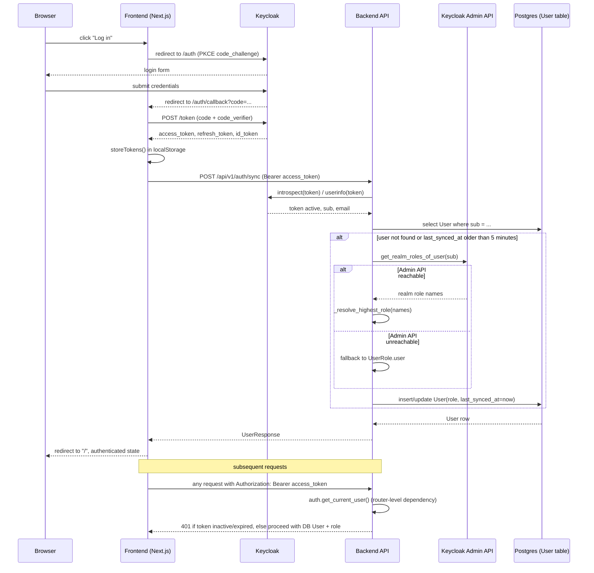

## Overview

Praktik AI delegates identity to a Keycloak realm (`praktikai-dev`) and treats the
backend Postgres `User` row as the source of truth for **roles**, while Keycloak
remains the source of truth for **identity** (the token `sub`). The frontend
never talks to the backend to log in — it runs a PKCE authorization-code flow
directly against Keycloak, stores the resulting tokens in `localStorage`, and
attaches the access token as a bearer token on API calls. The backend never
trusts role claims embedded in the JWT: on every request it introspects the
token for validity and resolves the user's role from the database, periodically
refreshing that role from the Keycloak Admin REST API.

Four roles exist, with a strict priority order used throughout the system:

```
user < lector < guarantor < superadmin
```

- **user** — base authenticated account (student).
- **lector** — course author/editor.
- **guarantor** — approves/rejects courses and moderates public resources.
- **superadmin** — full administrative access, including irreversible actions.

See [Data Model](data-model.md) for the `User` table shape, [System Overview](system-overview.md) for how this fits the wider architecture, [REST API Surface](../backend/rest-api-surface.md) for per-endpoint role requirements, and [Frontend App Structure](../frontend/app-structure.md) for where `useAuth` is consumed in the UI.

## Frontend token lifecycle

`frontend/src/lib/keycloak.ts` holds all Keycloak/OIDC mechanics; `frontend/src/hooks/useAuth.ts` is the React-facing wrapper.

**Login (PKCE, authorization-code flow).** `buildLoginUrl()` generates a random PKCE `code_verifier`, derives a `code_challenge` (SHA-256, base64url), stashes the verifier and an optional `state` in `sessionStorage`, and redirects the browser to Keycloak's `/auth` endpoint with `response_type=code`. Keycloak authenticates the user and redirects back to `/auth/callback?code=...`.

**Callback and token exchange.** The `/auth/callback` page (`frontend/src/app/auth/callback/page.tsx`) reads the `code`, calls `exchangeCodeForTokens()` (a `POST` to Keycloak's `/token` endpoint with the stored `code_verifier`), and on success:
1. Persists the returned access/refresh/ID tokens via `storeTokens()`.
2. Calls the backend `POST /api/v1/auth/sync` with the fresh access token so the DB `User` row is created/updated immediately (rather than waiting for the lazy sync on first authenticated call).
3. Redirects to `/`.

**Storage.** `storeTokens()` writes `kc_access_token`, `kc_refresh_token`, `kc_id_token`, and `kc_expires_at` to `localStorage`. The expiry timestamp is computed as `now + (expires_in - 30s)`, i.e. a 30-second safety margin is baked in at write time. Storing a new token set dispatches a `kc:login` `CustomEvent` so any other mounted `useAuth` instance (e.g. in a different tab/component) picks up the session without a reload.

**Expiry checks and refresh.** `isTokenExpiring(bufferSeconds = 60)` compares `Date.now()` against the stored `kc_expires_at` minus a buffer (default 60s). `getValidAccessToken()` is the single funnel for obtaining a usable token: it returns the stored token immediately if not expiring, otherwise refreshes via `refreshTokens()` (Keycloak `grant_type=refresh_token`). Concurrent callers share one in-flight refresh through a module-level `_refreshPromise` singleton, so multiple mounted `useAuth` instances collapse into exactly one `POST /token` instead of a duplicate-refresh race where one failure could wipe tokens the others just refreshed. A failed refresh calls `clearTokens()` (non-silent), which removes all stored keys and dispatches `kc:logout`.

**`useAuth()` lifecycle inside React:**
1. On mount (via `useLayoutEffect` to avoid a flash of "logged out" UI before paint), it reads `localStorage` synchronously; if the token is not near expiry it sets authenticated state directly from the decoded JWT, otherwise it calls `applyRefresh()`.
2. A timer schedules a proactive refresh 60 seconds before expiry (minimum 5s delay to avoid tight refresh loops).
3. A `visibilitychange` listener re-checks expiry and refreshes when a backgrounded tab becomes visible again.
4. `kc:logout` and `kc:login` window events keep all mounted instances of the hook in sync with out-of-band token changes (logout elsewhere, or a login completed by the callback page after this instance already mounted).
5. `logout()` builds Keycloak's `/logout` URL (with `id_token_hint` for a clean RP-initiated logout), clears local state and storage, and redirects the browser away — ending both the local session and the Keycloak SSO session.

`parseJwt()` decodes the JWT payload (no signature verification client-side — the backend is the trust boundary) and resolves the effective role client-side via `resolveRole()`, which walks `realm_access.roles` in `superadmin > guarantor > lector > user` order and returns the first match, defaulting to `user`. This client-side role is used only for UI gating (showing/hiding controls); it is *not* trusted for backend authorization decisions.

## Sequence: login through role resolution


*Login redirect through token issuance, backend token introspection, and Keycloak Admin API role sync with the 5-minute TTL and user-role fallback.*

## Backend: token validation and user sync (`api.dependencies`)

`backend/api/dependencies.py` defines the `Auth` class (instantiated once as the module-level `auth` singleton) and the `oauth2_bearer` scheme (`OAuth2PasswordBearer(tokenUrl="/api/v1/auth/token", auto_error=False)`).

**`Auth.get_current_user(token, db)`** is the central dependency almost every router relies on (exposed as the `CurrentUser` type alias, `Annotated[User, Depends(auth.get_current_user)]`). Its contract:
- Rejects requests with no bearer token (`401`).
- Calls `keycloak_openid.introspect(token)`; a token that is not `active` (expired/revoked) yields `401`.
- Calls `keycloak_openid.userinfo(token)` to obtain the token's `sub`, `email`, and `name`. **Roles are never read from the JWT** — only identity fields are used from the token.
- Looks up `User` by `sub` in Postgres:
  - If no row exists, it is created immediately, with its role resolved via the Keycloak Admin API (`_fetch_roles_from_admin_api`).
  - If a row exists, its role is refreshed only if `last_synced_at` is `None` or older than **`_ROLE_SYNC_TTL` (5 minutes)** — this bounds how often the (relatively expensive) Admin API call happens per user while still keeping role changes in Keycloak eventually consistent in the app DB.
- Raises `403` if the resolved `User.is_active` is `False` (deactivated account), independent of Keycloak state.

**Role resolution (`_resolve_highest_role`)**. Keycloak realm role names are mapped 1:1 to the `UserRole` enum (`user`, `lector`, `guarantor`, `superadmin`) via `_KC_ROLE_MAP`. Because a user can hold multiple realm roles simultaneously (e.g. both `user` and `lector`), `_resolve_highest_role` walks the role list and keeps the entry with the highest index in `_ROLE_PRIORITY = ["user", "lector", "guarantor", "superadmin"]`, so the effective app role is always the single highest-ranked role held. `_fetch_roles_from_admin_api` wraps this: on any exception talking to the Keycloak Admin API (`KeycloakAdmin.get_realm_roles_of_user`), it logs and falls back to `UserRole.user` rather than failing the request — a Keycloak Admin API outage degrades users to the least-privileged role instead of blocking login.

**`Auth.sync_user_from_token(token_str, db)`** performs the same identity+role resolution but is invoked explicitly from the `auth` router (`POST /auth/token` for password-grant login, and `POST /auth/sync` called by the frontend right after the PKCE callback) so the DB row exists and has a fresh role before the first business-logic request — it unconditionally re-fetches roles from the Admin API rather than checking the TTL.

**`require_role(min_role)`** is a dependency factory used at the router/endpoint level. It maps roles to a numeric `ROLE_HIERARCHY` (`user=1, lector=2, guarantor=3, superadmin=4`) and raises `403` ("Nedostatečná oprávnění") if the current user's level is below `min_role`'s level. Because the hierarchy is numeric, `require_role("lector")` also passes for `guarantor` and `superadmin` — it is a minimum-role gate, not an exact-role match. It is applied per-router or per-endpoint via `dependencies=[require_role("...")]`, layered on top of the router-level `get_current_user` dependency described below.

## Router-level authentication wiring (`api.src.routers`)

`backend/api/src/routers.py` is the composition root for all sub-routers and is where the blanket authentication boundary is enforced: most routers are mounted with `dependencies=[Depends(auth.get_current_user)]` at `include_router(...)` time, so every endpoint on those routers requires a valid bearer token *before* any endpoint-specific `require_role` check runs.

Two categories of routers are deliberately **excluded** from this blanket dependency:
- **`auth_router`** (`/auth/token`, `/auth/sync`, `/auth/me`, `/auth/profile`) — must be reachable without a prior session, since it is how a session is established (`/auth/me` and the profile endpoints still authenticate individually via the `CurrentUser` dependency inside their own handlers).
- **Public/catalog routers**: `courses_public_router`, `catalogs_router`, `resources_public_router`, `editor_images_public_router`, and `collections_public_router` are mounted with no auth dependency at all — these serve read-only catalog metadata (course blocks, targets, subjects, EQF levels, etc.), the published-course catalog, editor image retrieval (embedded as `` tags without auth headers), and public resource/collection browsing, all of which are intentionally anonymous-accessible surfaces.

Every other router (`courses`, `modules`, `activities`, `agents`, `users`, `enrollments`, `feedbacks`, `superadmin`, `module_tickets`, `editor_images` (authenticated variant), `resources`, `review`, `rating`, `collections` (authenticated variant)) is mounted with the blanket `auth.get_current_user` dependency, then further restricted per-endpoint with `require_role(...)` where a minimum role above plain `user` is required (e.g. course creation/editing requires `lector`, superadmin-only settings require `superadmin`, feedback creation/deletion requires `guarantor`).

## Ownership vs. role authorization (`api.authorization`)

Role checks (`require_role`) answer "is this role allowed to call this endpoint at all?". A second, orthogonal axis is **ownership**: many resources (courses, public resources, collections, ratings) carry an owner, and mutating them should generally be restricted to that owner — unless an elevated role should be allowed to override that restriction for moderation purposes. `backend/api/authorization.py` provides these ownership helpers, all operating on any `OwnedResource` (an object exposing `get_owner_id()`) plus the current `User`:

- **`validate_ownership(resource, user, resource_name, allow_elevated=True)`** — the most permissive form: passes if the caller owns the resource, *or* (when `allow_elevated=True`, the default) if the caller's role is `guarantor` or `superadmin`. It is defined as the general-purpose "owner-or-moderator" check but is not currently wired into any controller in this codebase — controllers instead reach for the two more specific helpers below when they need an ownership check, reserving `validate_ownership` for cases that need the elevated-role bypass with the default-permissive shape.
- **`validate_owner_or_superadmin(resource, user, resource_name)`** — passes only for the resource owner or `superadmin`; **guarantor is deliberately excluded**. This is the workhorse used across course, module, activity, agent, public-resource, rating, and collection controllers (e.g. `update_course`, `delete_course`, `create_course`, `update_module`) for standard "edit your own thing" mutations, because a guarantor's role is to *approve* content, not to edit or delete other users' resources on their behalf.
- **`validate_guarantor_or_superadmin(resource, user, resource_name)`** — the inverse restriction: only `guarantor` or `superadmin` may proceed, and ownership is irrelevant. Used for moderation actions — approving/rejecting a course transition, moderating public-resource comments, and course-review creation/deletion.
- **`validate_superadmin(user, resource_name)`** — the strictest gate: only `superadmin` passes. Used for irreversible or highly sensitive transitions, such as reverting an already-approved course back into editing (`update.py`'s course-status controller).

All four helpers raise `HTTPException(404)` if the resource is missing (via the shared `_check_resource_exists`) and `HTTPException(403)` with a Czech-language message if the caller fails the check; none of them mutate state themselves, they are called at the top of a controller function before any write happens.

**Worked example — course status transitions** (`backend/api/src/courses/controllers/update.py`): submitting a course for review (`status → in_review`) requires `validate_owner_or_superadmin`; approving or rejecting a course already `in_review` requires `validate_guarantor_or_superadmin`; reverting an `approved` course back to `edited` requires `validate_superadmin`; all other transitions default to `validate_owner_or_superadmin`. This mirrors the course lifecycle's real-world approval workflow: authors submit and edit, guarantors approve/reject, and only superadmins can undo an approval.

## Keycloak realm configuration

`infra/keycloak/praktikai-dev-realm.json` provisions the `praktikai-dev` dev realm with:
- Four realm roles matching `UserRole` exactly: `user`, `lector`, `guarantor`, `superadmin`, with `user` as the `defaultRoles` entry so every new registration starts unprivileged.
- Two clients: `app` (confidential, `serviceAccountsEnabled`, used by the backend both for the password grant on `/auth/token` and, via its service account, for the Keycloak Admin API role lookups performed by `_get_admin_client`/`_fetch_roles_from_admin_api`) and `praktik-ai-app` (public SPA client, PKCE-only, `standardFlowEnabled`, no direct-access grants) — the client the frontend redirects to.
- A `roles` client scope mapping so realm roles are exposed to consumers.

## Invariants and failure modes

- JWT role claims are never trusted by the backend; the DB `User.role` (refreshed at most every 5 minutes from the Keycloak Admin API) is the sole authorization source of truth server-side.
- A Keycloak Admin API failure during role sync degrades a user to `UserRole.user` rather than blocking the request — availability is prioritized over staying at an elevated role, at the cost of temporarily under-privileging a user until the next successful sync.
- A deactivated `User.is_active = False` is rejected with `403` even if the Keycloak token itself is valid, so deactivation can be enforced purely in the application DB without needing to also disable the Keycloak account.
- Router-level `Depends(auth.get_current_user)` is the default; a router is unauthenticated only by deliberate omission from that dependency list (the `auth` router itself, plus the public catalog/resource/collection routers) — adding a new router without wiring authentication is the main way an endpoint could accidentally become anonymous-accessible.
- `require_role` is a minimum-role (numeric) check, so any endpoint gated at `require_role("lector")` is implicitly reachable by `guarantor` and `superadmin` too; role-exclusive behavior (e.g. "guarantor only, not superadmin's subordinate roles") must instead be expressed with the `validate_*` ownership helpers, not `require_role`.
