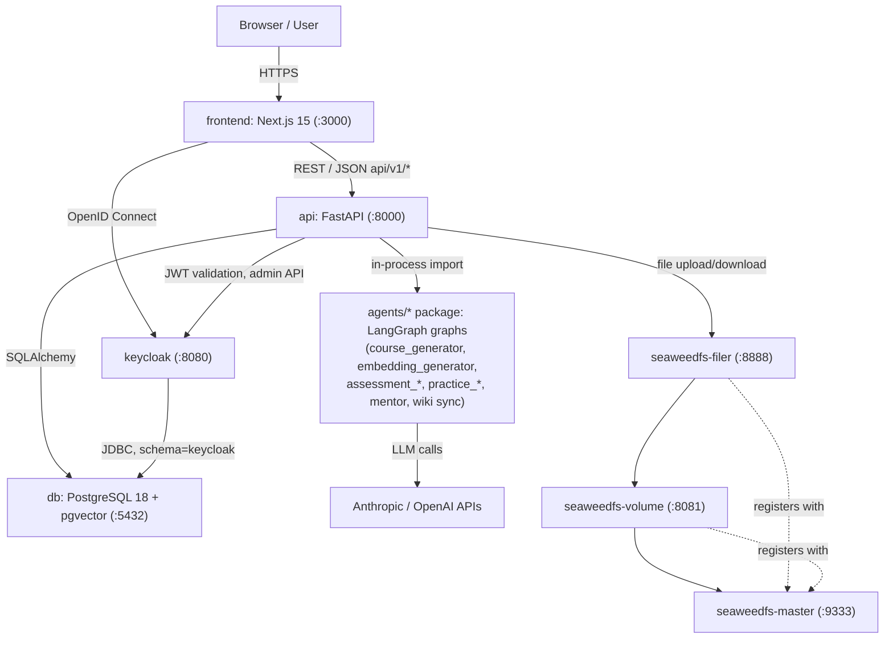
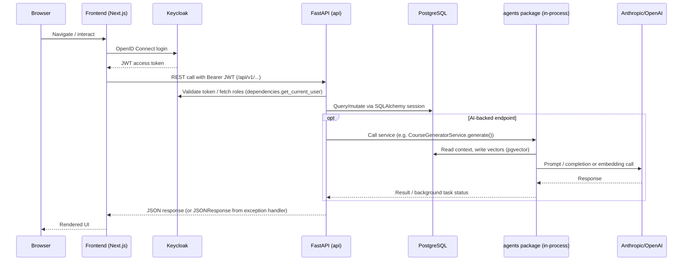

## Purpose

Praktik-AI is a platform for developing AI competencies of academic staff through
AI-assisted courses. This page describes the overall runtime topology: which
services exist, how they are wired together via `compose.yml`, and how the
FastAPI backend (`backend/api/main.py`) boots, serves requests, and hosts the
in-process LangGraph agents.

For the authentication/authorization details see
[Auth and RBAC](auth-and-rbac.md); for the ORM schema see
[Data Model](data-model.md); for outbound calls to Anthropic/OpenAI and other
third-party integrations see
[External Services](../integrations/external-services.md); for environment
variables and deployment specifics see
[Deployment and Configuration](../operations/deployment-and-configuration.md).

## Service topology

The stack is defined in [`compose.yml`](../../compose.yml) as seven services on
a single bridge network (`praktikai`): `frontend`, `api`, `db`, `keycloak`, and
three SeaweedFS roles (`seaweedfs-master`, `seaweedfs-volume`,
`seaweedfs-filer`). There is **no separate "agents" service** — the LangGraph
agents in `backend/agents/` are a plain Python package imported and executed
inside the `api` container's process (see [In-process agents](#in-process-agents-not-a-separate-service)
below).


*Service topology: browser traffic reaches the frontend and Keycloak directly; the API is the only component that talks to Postgres, SeaweedFS, and the LLM providers, and it runs the agents in the same process rather than as a separate service.*

### Compose wiring notes

- **frontend** builds from `infra/docker/fe.Dockerfile`, depends on `api`, and
  bakes `NEXT_PUBLIC_KEYCLOAK_URL`, `NEXT_PUBLIC_KEYCLOAK_REALM`,
  `NEXT_PUBLIC_KEYCLOAK_CLIENT_ID`, and `NEXT_API_URL` in as build args (Next.js
  `NEXT_PUBLIC_*` variables are inlined at build time, not read at runtime).
- **api** builds from `infra/docker/backend.Dockerfile`, mounts
  `./backend:/code` and `./wiki_data:/wiki_data`, waits for `db` to report
  healthy, and exposes a `/health` endpoint used by its own Docker healthcheck
  (`GET http://localhost:8000/health`, 15s interval, 10 retries, 20s start
  period).
- **db** is `pgvector/pgvector:0.8.1-pg18-trixie` (PostgreSQL 18 with the
  pgvector extension baked in), persisted to the `postgres-data` volume and
  exposed on host port `5433` (container port `5432`). It is shared by both the
  application schema and the Keycloak schema.
- **keycloak** (`quay.io/keycloak/keycloak:26.4.0`, `start-dev --import-realm`)
  depends on `api` being healthy, stores its own data in the same `db`
  instance via `KC_DB_URL=jdbc:postgresql://db:5432/<POSTGRES__DB>?currentSchema=keycloak`,
  and imports a dev realm from `infra/keycloak/praktikai-dev-realm.json`.
- **seaweedfs-master/volume/filer** run as three independent containers of the
  same `chrislusf/seaweedfs:latest` image with different commands (`master`,
  `volume -mserver=seaweedfs-master:9333`, `filer -master=seaweedfs-master:9333`);
  the filer is the only one the API and users are expected to talk to, and it
  and the volume server register themselves with the master. Configuration is
  read by the backend from `SEAWEEDFS__MASTER_URL` /
  `SEAWEEDFS__FILER_URL` (see `backend/api/config.py`).

`infra/docker/nginx.Dockerfile` exists in the repo but is not referenced by any
service in `compose.yml`; there is no reverse proxy in front of the stack as
configured today, so `frontend`, `api`, and `keycloak` are each reached
directly on their published ports.

## Backend process: `backend/api/main.py`

### Import-time startup sequence

`main.py` is imported once per process (once per uvicorn worker). At **module
import time**, before the `app` object is fully usable and before any request
is served, it runs, in order:

1. `init_db(create_extensions=True)` (`backend/api/database.py`) — opens a
   connection, creates the `pg_trgm` Postgres extension if missing (used by
   trigram indexes such as `ix_course_title_trgm`), and calls
   `Base.metadata.create_all()` to create every SQLAlchemy table and enum type
   that does not yet exist. This is idempotent create-if-missing DDL, not a
   migration tool.
2. `seed_db()` (`backend/api/seed.py`) — populates reference/catalog data
   (course blocks, targets, requirements, EQF levels, Bloom levels, KRAUU
   competences, neuro-principles, system settings, etc.) using its own
   `SessionLocal()`.

Both calls happen unconditionally on every process start, so they must be safe
to re-run against an already-initialized database.

### Lifespan hook: wiki-sync scheduler

```python
@asynccontextmanager
async def lifespan(app: FastAPI):
    start_wiki_sync_scheduler()
    yield
    stop_wiki_sync_scheduler()

app = FastAPI(docs_url="/", lifespan=lifespan)
```

`start_wiki_sync_scheduler()` / `stop_wiki_sync_scheduler()` live in
`backend/agents/wiki/agent/scheduler.py` and manage a module-level
`AsyncIOScheduler` (APScheduler). On startup it:

- registers a recurring job `wiki_sync` on an `IntervalTrigger` whose period is
  `settings.wiki.sync_interval_hours` (default 12h), `replace_existing=True` so
  repeated starts (e.g. `--reload`) do not duplicate the job;
- starts the scheduler if it is not already running;
- checks whether the `langchain_pg_embedding`/`langchain_pg_collection` tables
  contain any rows for the wiki collection (`WIKI_COLLECTION_NAME`); if the
  index is empty (including a brand-new database where those pgvector tables
  do not exist yet), it also enqueues a one-off bootstrap job so the wiki chat
  feature has content to answer from immediately rather than waiting a full
  interval.

Each sync run (`_run_wiki_sync_job` → `sync_wiki()` in
`backend/agents/wiki/agent/service.py`) clones/pulls the project's GitHub wiki
repository (`settings.wiki.repo_url`, checked out to `settings.wiki.local_path`,
mounted into the container at `/wiki_data`) and re-runs it through a LangGraph
graph (`agents/wiki/agent/graph.py`) that re-indexes pages into pgvector.
Failures are caught and logged, not raised, so a broken wiki sync never crashes
the scheduler or the API process. On shutdown, `stop_wiki_sync_scheduler()`
calls `scheduler.shutdown(wait=False)` if it is running.

### Route registration and dependency-scoped auth

After the exception handlers and CORS middleware are registered (see below),
`main.py` mounts `/health` directly on `app` and includes the aggregate router
from `api/src/routers.py` under the `/api/v1` prefix. That aggregate router:

- includes `auth`, the public course-catalog endpoints, and `catalogs` **without**
  an auth dependency;
- includes `courses`, `modules`, `activities`, `agents`, `users`,
  `enrollments`, `feedbacks`, `superadmin`, `module_tickets`, and
  `editor_images` each with `dependencies=[Depends(auth.get_current_user)]`,
  i.e. every request to these sub-routers must first pass Keycloak-backed
  bearer-token validation;
- includes a "public DB" group (`resources`, `reviews`, `rating`,
  `collections`) with a mix of public and authenticated sub-routers.

Fine-grained role checks (e.g. `lector`, `guarantor`, `superadmin`) are applied
inside individual route handlers via `require_role` / `validate_owner_or_superadmin`
rather than at the router level; see
[Auth and RBAC](auth-and-rbac.md) for the full authorization model.

### CORS posture

```python
app.add_middleware(
    CORSMiddleware,
    allow_origins=["*"],
    allow_credentials=True,
    allow_methods=["*"],
    allow_headers=["*"],
)
```

The API allows **any** origin, method, and header, combined with
`allow_credentials=True`. This is a deliberately open (comment: "Next.js
frontend") but permissive posture: it makes local/dev integration frictionless
but means the API itself does not enforce origin-based CSRF protection — that
burden falls entirely on bearer-token auth and any reverse proxy placed in
front of it in production. Anyone deploying this behind a public hostname
should treat `allow_origins=["*"]` as a known, intentional trade-off to
revisit, not a bug to silently work around.

### Global exception handlers

`main.py` installs two application-wide FastAPI exception handlers:

- `IntegrityError` (SQLAlchemy/`psycopg`) → logged at `error` level and
  translated into an HTTP `400` with body
  `{"detail": "Porušení integritního omezení databáze"}` ("database integrity
  constraint violation"). This means any unhandled unique/foreign-key/check
  constraint violation raised by a route handler surfaces as a client error
  instead of a raw 500, without leaking the underlying SQL error text to the
  caller.
- Bare `Exception` → logged at `error` level with a full traceback
  (`exc_info=True`) and translated into an HTTP `500` with body
  `{"detail": "Nečekávaná chyba serveru"}` ("unexpected server error"). This is
  the last-resort catch-all: any exception not otherwise handled by a route or
  a more specific handler produces a generic 500 rather than an unhandled
  crash, and full details only ever reach the server log, not the response
  body.

Both handlers return Czech-language user-facing messages, consistent with the
rest of the API's error strings.

## Request flow


*Typical authenticated request: the frontend authenticates against Keycloak, calls the FastAPI API with a bearer token, and AI-backed endpoints invoke the agents package in-process rather than calling out to another service.*

## In-process agents, not a separate service

`backend/agents/` (course_generator, embedding_generator, assessment_generator,
assessment_evaluator, practice_question_generator, practice_answer_evaluator,
mentor, sql_agent, wiki, and shared `base`/`vector_store` modules) is a plain
Python package that ships inside the same container image as `backend/api/`
(`infra/docker/backend.Dockerfile` copies both `./backend/api` and
`./backend/agents` into `/code`). It is **not** deployed, scaled, or addressed
as its own service in `compose.yml`.

Two invocation paths exist for this package:

1. **Synchronous/foreground or asyncio background tasks inside request
   handling**: `api/src/agents/routers.py` imports services such as
   `CourseGeneratorService`, `EmbeddingGeneratorService`, `MentorService`,
   `AssessmentService`, `EvaluationService`, and `WikiChatService` directly and
   calls them from route handlers, in some cases scheduling long-running work
   (e.g. `_run_course_generation`) as an `asyncio` background task that opens
   its own `SessionLocal()` DB session so it can outlive the originating HTTP
   request.
2. **Scheduled background job via the FastAPI lifespan hook**: the wiki-sync
   scheduler described above imports and calls `sync_wiki()` from
   `agents.wiki.agent.service` on a timer, independent of any inbound request.

Because agents run in the API's own process and event loop, they share its
database connection pool/engine (`api.database.engine`), its configuration
(`api.config.settings`), and its Python dependency set — there is no network
hop, serialization boundary, or separate deployment lifecycle between
"backend" and "AI agents". The practical consequence is that a crash or hang
inside an agent call can affect the API process, and scaling agents means
scaling API replicas, not a distinct agents service.

## Configuration surface (`backend/api/config.py`)

`Settings` (Pydantic `BaseSettings`, `env_nested_delimiter="__"`,
`case_sensitive=False`, `extra="ignore"`) is instantiated once at import time
as the module-level `settings` object and is the single source of runtime
configuration for the API and the agents package:

- `postgres.*` (`POSTGRES__HOST`, `POSTGRES__PORT`, `POSTGRES__USER`,
  `POSTGRES__PASSWORD`, `POSTGRES__DB`) builds the
  `postgresql+psycopg://...` connection string used by
  `api/database.py`'s SQLAlchemy `engine`.
- `keycloak.*` (`KEYCLOAK__SERVER_URL`, `KEYCLOAK__REALM_NAME`,
  `KEYCLOAK__CLIENT_ID`, `KEYCLOAK__CLIENT_SECRET`) configures the
  `KeycloakOpenID`/`KeycloakAdmin` clients used in `api/dependencies.py`.
- `seaweedfs.*` (`SEAWEEDFS__MASTER_URL`, `SEAWEEDFS__FILER_URL`) has hardcoded
  defaults pointing at the compose service names (`seaweedfs-master`,
  `seaweedfs-filer`), so the setting only needs overriding outside the default
  compose topology.
- `wiki.*` (`WIKI__SYNC_INTERVAL_HOURS`, `WIKI__REPO_URL`, `WIKI__LOCAL_PATH`)
  controls the GitHub wiki mirror/sync interval consumed by the scheduler
  above.

Because `extra="ignore"`, unrecognized environment variables are silently
dropped rather than raising a validation error — a convenience for shared
`.env` files across services, at the cost of not failing fast on typoed
variable names.

## Known operational posture (summary)

- CORS is wide open (`allow_origins=["*"]`) — see [CORS posture](#cors-posture).
- `init_db()` + `seed_db()` run unconditionally on every process start/import,
  making the API container self-provisioning against an empty database but
  requiring idempotent seed/DDL logic.
- The wiki-sync scheduler both self-bootstraps (fills an empty index
  immediately) and self-heals from failures (logs and continues rather than
  crashing the API).
- There is no reverse proxy / API gateway service wired into `compose.yml`
  despite an `nginx.Dockerfile` existing in the repository; each service is
  reachable directly on its published port.
