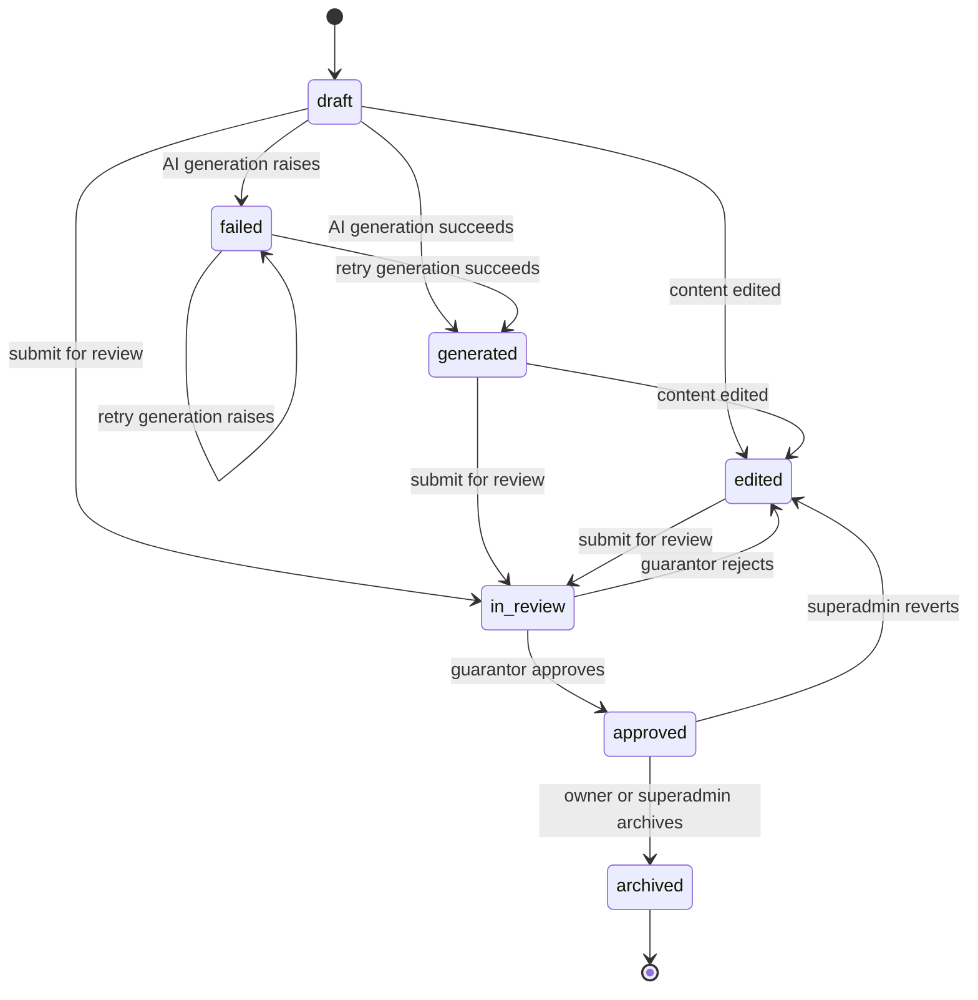
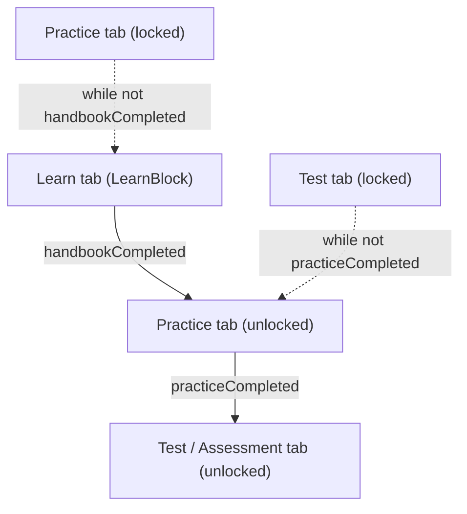
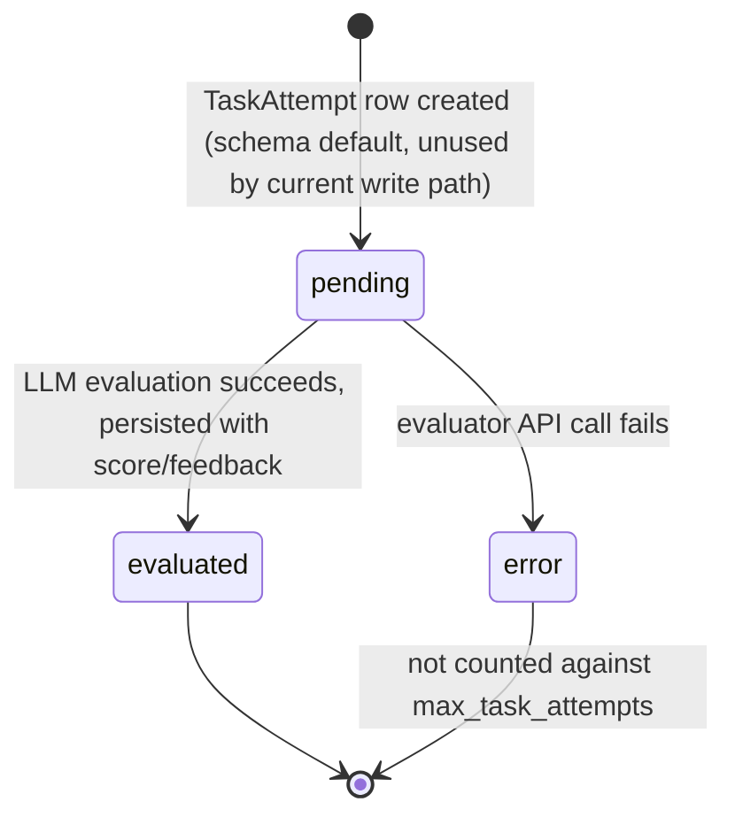

## Overview

The product's central domain concept is the **Course**, made up of ordered
**Modules**. Each Module carries a three-stage learner lifecycle:

1. **Learn** — one rich-text `LearnBlock` explaining the concept.
2. **Practice** — ungraded `PracticeQuestion`s (closed or open) the learner can
   retry freely, used to rehearse before the graded test.
3. **Assessment** — a single AI-generated concept-check question per module,
   attempted through a `ModuleTaskSession` with a capped number of `TaskAttempt`s.

A learner only progresses through this lifecycle once **enrolled** in the
course, and a Course itself moves through an authoring/review/publishing
state machine (`Status`) independent of any single learner's progress.
<!-- openwiki: broken internal link [../../backend/api/src/modules] file "../../backend/api/src/modules" does not exist. Fix the href or restore the target, then delete this comment. -->
<!-- openwiki: broken internal link [../../backend/api/src/activities] file "../../backend/api/src/activities" does not exist. Fix the href or restore the target, then delete this comment. -->
<!-- openwiki: broken internal link [../../backend/api/src/enrollments] file "../../backend/api/src/enrollments" does not exist. Fix the href or restore the target, then delete this comment. -->
<!-- openwiki: broken internal link [../../backend/api/src/courses/controllers] file "../../backend/api/src/courses/controllers" does not exist. Fix the href or restore the target, then delete this comment. -->
Source: [enums.py](../../backend/api/enums.py), [modules](../../backend/api/src/modules), [activities](../../backend/api/src/activities), [enrollments](../../backend/api/src/enrollments), [courses/controllers](../../backend/api/src/courses/controllers).

For the request/response shapes of the endpoints mentioned here, see
[REST API Surface](../backend/rest-api-surface.md). For the AI generation and
evaluation pipelines invoked by these endpoints, see
[Assessment & Practice workflow](../workflows/assessment-and-practice.md) and
[Course Generation workflow](../workflows/course-generation.md). For the full
entity/relationship picture, see [Data Model](../architecture/data-model.md).

## Domain model at a glance

- **Course** — `owner_id`, `status`, `is_published`, `approved_by_id`,
  catalog metadata (target group, EQF level, subject, difficulty …), and a
  collection of active `modules` (relationship filtered to `is_active=True`).
- **Module** — belongs to one Course, carries `max_task_attempts` (1–20,
  default 3) and `passing_score` (model default `75`, not exposed in
  `ModuleCreate`/`ModuleUpdate`, so it is effectively fixed unless changed at
  the database level), plus catalog tags (Bloom levels, KRAUU competences,
  neuroscience principles). Modules have no explicit position column — their
  order is the creation order, i.e. ascending `module_id`, which is exactly
  the order every "next module" / progress computation iterates in.
- **LearnBlock** — one active rich-text block per Module (enforced by a
  unique-active index and a create-time check in the controller); its
  `content` can embed images uploaded through the editor_images subsystem.
- **PracticeQuestion** / **PracticeOption** / **QuestionKeyword** —
  author-defined practice question bank per module (closed questions have
  scored `PracticeOption`s; open questions have `QuestionKeyword`s used by the
  AI evaluator).
- **UserPracticeQuestion** / **UserPracticeAttempt** — per-user *instances* of
  practice questions (AI-generated from the question bank) and the learner's
  attempts against them; unlimited retries except that once one attempt is
  marked correct, further attempts on that instance are rejected (409).
- **Enrollment** — the `(user_id, course_id)` link that gates progress
  tracking; also stores resume-state (`last_visited_module_id`,
  `last_activity_at`, `completed_at`).
- **ModuleTaskSession** — one active assessment attempt-cycle per
  `(user, module)`; a partial unique index enforces at most one row in
  `in_progress` or `passed` state per pair, while `failed` sessions are kept
  as history and do not block creating a new session.
- **TaskAttempt** — one graded submission within a `ModuleTaskSession`,
  carrying `status`, `ai_score`, `ai_feedback`, `is_passed`.

Evidence: [models.py#L511-L601](../../backend/api/models.py#L511-L601), [modules/schemas.py](../../backend/api/src/modules/schemas.py), [activities/controllers.py](../../backend/api/src/activities/controllers.py), [models.py#L1289-L1334](../../backend/api/models.py#L1289-L1334).

## Course.status lifecycle

`Status` (`backend/api/enums.py`) drives which operations are allowed on a
course. A new course starts at `draft`. AI course generation
(`agents/course_generator`) moves it to `generated` on success or to `failed`
on any exception, and generation can be retried from either `draft` or
`failed`. Any content edit made while the course is `draft` or `generated`
auto-transitions it to `edited` (`update_course`). Course-, Module-,
LearnBlock-, PracticeQuestion-, PracticeOption- and QuestionKeyword-level
edits are all gated by `assert_course_editable`, which only allows mutation
while status is `draft`, `generated`, or `edited`.

Explicit status changes go through `update_course_status`, which enforces a
transition table and role checks:

- `draft` / `generated` / `edited` → `in_review`: owner or superadmin submits
  for review.
- `in_review` → `approved`: guarantor or superadmin only; the approver cannot
  be the course owner (`ck_course_owner_not_approver` DB constraint, plus an
  explicit check); `approved_by_id` is recorded.
- `in_review` → `edited`: guarantor or superadmin rejects back to editing
  (this is also how course feedback/review comments are attached — feedback
  can only be created while status is `in_review` or `edited`).
- `approved` → `edited`: superadmin-only revert; clears `approved_by_id` and
  forces `is_published = False`.
- `approved` → `archived`: owner or superadmin.

`is_published` is a separate boolean toggled only while status is `approved`
or `archived`, and enrollment additionally requires both `is_published` and
`status == approved`.

Caption: Course.status transitions, with the role allowed to trigger each one; edits and enrollment are only possible in specific states.

Evidence: [courses/controllers/update.py#L128-L177](../../backend/api/src/courses/controllers/update.py#L128-L177), [common/utils.py#L72-L80](../../backend/api/src/common/utils.py#L72-L80), [agents/routers.py#L63-L109](../../backend/api/src/agents/routers.py#L63-L109), [agents/course_generator/nodes/save_to_db.py](../../backend/agents/course_generator/nodes/save_to_db.py), [feedbacks/controllers.py#L52-L67](../../backend/api/src/feedbacks/controllers.py#L52-L67), [enrollments/controllers.py#L70-L76](../../backend/api/src/enrollments/controllers.py#L70-L76).

## Enrollment as the progress gate

`Enrollment` is the authorization boundary between "can view a course
description" and "can consume its modules and be tracked". A learner can
only enroll into a course that is `is_published` and `status == approved`
(`create_enrollment`); ordinary users may only enroll themselves, while
guarantors/superadmins may enroll anyone. Leaving a course sets `left_at`
(self-service `leave_enrollment`, or lector-triggered `delete_enrollment`),
and a superadmin-only `soft_delete_enrollment` deactivates the row entirely.

The shared helper `check_enrollment(db, user, course, bypass_for_owner=...)`
is the single gate reused by every agent/practice/assessment/ticket endpoint
that needs "is this user allowed to work through this module": it raises
403 unless an active enrollment (`is_active` and `left_at is None`) exists.
`bypass_for_owner=True` lets the course owner and superadmins exercise a
module (e.g. the tutor chat, or `complete_module`) without enrolling
themselves; generating or evaluating assessments (`generate_assessment`,
`evaluate_assessment` indirectly via the session, `generate_practice_question`,
`evaluate_practice_answer`, module tickets) requires enrollment for
**everyone**, including the owner, since these consume graded/limited
resources.

Beyond authorization, `Enrollment` is also where progress is read back from:
`my_enrollments` computes, per enrollment, `completed_modules`/`total_modules`
from `ModuleTaskSession.status == passed`, and a `next_module` (first
not-yet-passed module in `module_id` order) so the frontend can offer a
"resume where you left off" action without its own heuristic.
`mark_module_visited` (called by the frontend whenever a module page opens)
silently no-ops if the user isn't enrolled, and otherwise updates
`last_visited_module_id`/`last_activity_at` used both for resume and for the
`/enrollments/my/activity` heat-map endpoint (which also aggregates enrollment
creation and course completion events per day).

Evidence: [enrollments/controllers.py#L52-L93](../../backend/api/src/enrollments/controllers.py#L52-L93), [common/utils.py#L83-L111](../../backend/api/src/common/utils.py#L83-L111), [agents/routers.py#L234-L235](../../backend/api/src/agents/routers.py#L234-L235), [agents/routers.py#L303-L304](../../backend/api/src/agents/routers.py#L303-L304), [modules/controllers.py#L210-L222](../../backend/api/src/modules/controllers.py#L210-L222), [module_tickets/controllers.py#L41](../../backend/api/src/module_tickets/controllers.py#L41), [enrollments/controllers.py#L137-L259](../../backend/api/src/enrollments/controllers.py#L137-L259), [enrollments/controllers.py#L276-L304](../../backend/api/src/enrollments/controllers.py#L276-L304).

## Module unlocking: Learn -> Practice -> Assessment

Within a module, the three tabs are gated in strict order by the module
page: Practice is locked until the Learn tab (`handbookCompleted`) is marked
done, and the Assessment/Test tab is locked until Practice
(`practiceCompleted`) is marked done. This gating is client-side UI state
(tracked per-module in `sessionStorage` and reset by
`ModuleCompletionStatus.passed`, which unlocks and marks all three
sections done at once for an already-passed module) — the backend does not
independently re-verify Learn/Practice completion when a request for
Practice or Assessment endpoints arrives, so the ordering is a UX affordance
enforced by the module page, not a server-side precondition on those
specific endpoints. What the backend *does* enforce server-side is
enrollment (see above), course/module active + approved status, and the
per-module attempt cap described below.

Caption: Client-side tab gating on the module page — Practice unlocks after Learn, Test unlocks after Practice.

Completing a module (`complete_module`, called from the Practice flow with a
score) requires enrollment and directly writes a `passed` `ModuleTaskSession`
(idempotent — a no-op if one already exists). After recording it, the
controller checks whether *every* active module in the course now has a
`passed` session for that user; if so it stamps `Enrollment.completed_at`.

Evidence: [frontend/.../modules/[slug]/page.tsx#L279-L302](../../frontend/src/app/(main)/modules/%5Bslug%5D/page.tsx#L279-L302), [frontend/.../modules/[slug]/page.tsx#L120-L128](../../frontend/src/app/(main)/modules/%5Bslug%5D/page.tsx#L120-L128), [modules/controllers.py#L210-L274](../../backend/api/src/modules/controllers.py#L210-L274).

## Assessment sessions, attempt caps, and evaluator failures

`ModuleTaskSessionStatus` (`in_progress` / `passed` / `failed`) tracks one
assessment cycle per `(user, module)`. `generate_assessment` refuses to start
a new cycle if a `passed` or `in_progress` session already exists (409), but
a prior `failed` session does **not** block a new attempt: calling
`generate-assessment` again either reuses (regenerates the question on) an
existing `in_progress` row, or creates a brand-new session, giving the
learner a fresh attempt budget.

Each submitted answer becomes a `TaskAttempt` with `AttemptStatus`
(`pending` / `evaluated` / `error`). `evaluate_assessment` first counts
attempts with `status == evaluated` against `module.max_task_attempts` and
returns 409 if the cap is already reached — **only evaluated attempts count
against the cap**. The evaluation itself runs an `EvaluationService`
LangGraph (`load_context` → `evaluate_answer` → `persist_result`): a row is
only ever persisted in `persist_result`, *after* the LLM call in
`evaluate_answer` has already succeeded, with `status=evaluated` directly (no
row is created up front as `pending`). Consequently, if the evaluator LLM/API
call itself fails, `evaluate_answer` raises before `persist_result` runs, no
`TaskAttempt` row is committed at all, and the exception propagates as a
server error to the caller — the failed call **does not consume an attempt**,
which is exactly the invariant the `AttemptStatus.error` comment in
`enums.py` documents ("API spadlo (nepočítá se jako vyčerpaný pokus)").
`persist_result` marks the session `passed` if `is_passed`, otherwise
`failed` once the evaluated-attempt count reaches `max_task_attempts`, or
leaves it `in_progress` to allow another attempt.

The ungraded Practice flow (`PracticeQuestion`/`UserPracticeAttempt`) has no
attempt cap and no `AttemptStatus`/session state machine of its own — closed
questions are graded by direct option comparison
(`_evaluate_closed`), open questions by `PracticeAnswerEvaluator`; once one
attempt on a given generated instance is correct, later attempts on the same
instance are rejected with 409, but the learner can keep generating new
practice question instances indefinitely.

```mermaid
stateDiagram-v2
    [*] --> in_progress: generate_assessment (no active session)
    in_progress --> passed: evaluate_assessment, is_passed=true
    in_progress --> in_progress: evaluate_assessment, failed but attempts remain
    in_progress --> failed: evaluate_assessment, failed and attempts exhausted
    passed --> [*]
    failed --> [*]: history retained; new session can be generated later
```

Caption: ModuleTaskSessionStatus lifecycle for one assessment cycle.

Caption: AttemptStatus per submitted answer; only `evaluated` counts toward the module's attempt cap, and the current implementation never persists a row on evaluator failure, so `error` is reachable only conceptually today.

Evidence: [agents/routers.py#L283-L413](../../backend/api/src/agents/routers.py#L283-L413), [agents/assessment_generator/nodes/persist_session.py](../../backend/agents/assessment_generator/nodes/persist_session.py), [agents/assessment_evaluator/graph.py](../../backend/agents/assessment_evaluator/graph.py), [agents/assessment_evaluator/nodes/evaluate_answer.py](../../backend/agents/assessment_evaluator/nodes/evaluate_answer.py), [agents/assessment_evaluator/nodes/persist_result.py](../../backend/agents/assessment_evaluator/nodes/persist_result.py), [models.py#L1311-L1334](../../backend/api/models.py#L1311-L1334), [enums.py#L44-L54](../../backend/api/enums.py#L44-L54), [agents/practice_controllers.py](../../backend/api/src/agents/practice_controllers.py).

## editor_images: images inside LearnBlock rich text

`LearnBlock.content` is free-form rich text (HTML/Markdown from the admin
editor) that can embed images. The `editor_images` module provides a small,
self-contained upload/serve pair used by that editor rather than the general
`CourseFile`/attachment pipeline:

- `POST /editor-images` (`upload_editor_image`, requires `user` role) accepts
  an `UploadFile`, restricts `content_type` to
  `image/jpeg|png|webp|gif|svg+xml`, caps size at 10 MB (413 if exceeded,
  415 for disallowed types), generates a random `uuid4` filename preserving
  the original extension, and uploads it to SeaweedFS under the
  `editor-images/` prefix. It returns a stable public URL
  (`/api/v1/editor-images/{filename}`) that the editor writes directly into
  the block's HTML (e.g. an `` tag).
- `GET /editor-images/{filename}` (`get_editor_image`) is mounted on a
  **public** router (no auth dependency) precisely because rendered
  LearnBlock content embeds plain `` tags with no way to attach
  auth headers; it rejects path traversal (`/` or `..` in the filename) and
  streams the file back from SeaweedFS with a guessed `media_type`, 404 if
  missing.

Because uploaded filenames are random UUIDs and the endpoint is public,
security relies on filename unguessability rather than access control —
anyone who obtains a URL (e.g. from page source) can fetch that one image.

Evidence: [editor_images/controllers.py](../../backend/api/src/editor_images/controllers.py), [editor_images/routers.py](../../backend/api/src/editor_images/routers.py), [routers.py#L47-L64](../../backend/api/src/routers.py).

## Course progress readout

`get_course_progress(course_id, user)` returns, per active module, whether it
is `passed`, the relevant `ModuleTaskSession` status (preferring `passed`/
`in_progress` over the latest `failed`), and `attempts_used`/`max_attempts`/
`passing_score` — this is the same session-selection priority used by
`get_assessment_question` to resume an in-progress or already-passed
assessment, or otherwise surface the most recent failed attempt's outcome.

Evidence: [modules/controllers.py#L277-L380](../../backend/api/src/modules/controllers.py#L277-L380).
