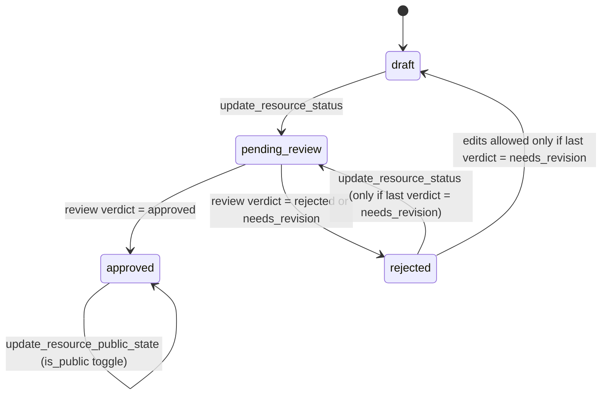
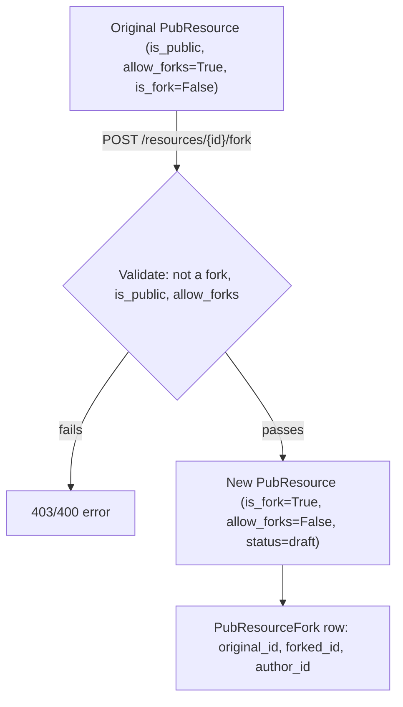

## Overview

The Public Resource Library ("publicDB", surfaced on the frontend as **Veřejná
databáze** / `/verejna-databaze`) is a self-contained feature module that lets
users publish, review, rate, comment on, fork, and collect shareable teaching
materials. It is architecturally independent from the course/enrollment domain
(see [Data Model](../architecture/data-model.md)): a `PubResource` is not tied
to a course, module, or activity — it is a standalone artifact with its own
moderation lifecycle, authorship, and visibility rules.

The backend lives under `backend/api/src/publicDB/`, split into four
sub-packages that each follow the same `routers.py` / `schemas.py` /
`controllers/` layout used elsewhere in the API (see
[REST API Surface](../backend/rest-api-surface.md)):

- **`resources/`** — the `PubResource` entity itself: CRUD, status transitions, file attachments, moderation comments, and forking.
- **`reviews/`** — guarantor verdicts (`PubResourceReview`) that drive the approval workflow.
- **`rating/`** — 1–5 star ratings with optional text (`PubResourceRating`).
- **`collections/`** — user-curated folders of approved resources (`PubCollection`).

## Router split: public vs. authenticated

Mirroring the courses module's public/private router pattern (see
[REST API Surface](../backend/rest-api-surface.md)), the `resources` and
`collections` sub-packages each expose two `APIRouter` instances that are
mounted differently in `backend/api/src/routers.py`:

- `resources.routers.public_router` (`list_resources`, unauthenticated) and
  `collections.routers.public_router` (`get_public_collections`, unauthenticated)
  are included with no auth dependency, alongside `auth_router` and
  `courses_public_router`.
- `resources.routers.router`, `reviews.routers.router`, `rating.routers.router`,
  and `collections.routers.router` are all included with
  `dependencies=[Depends(auth.get_current_user)]`, requiring a logged-in user.

Individual routes additionally layer `require_role(...)` dependencies for
finer-grained checks (e.g. `require_role("guarantor")` on review/comment
creation). One asymmetry worth knowing when changing this code: `list_reviews`
(`GET /reviews`) has no `require_role` guard of its own, so any authenticated
user (not just guarantors) can list reviews, while `get_resource_ratings` and
`list_ratings` both require `require_role("user")` explicitly even though the
router is already auth-gated.

This means anonymous visitors to `/verejna-databaze` can browse the published
catalog and public collections, but must sign in to see resource detail
comments/files metadata beyond what `list_resources`/`get_public_collections`
expose, rate, comment, review, fork, or manage their own collections — the
frontend's `[id]/page.tsx` detail route explicitly gates on `isAuthenticated`
and shows a login prompt otherwise.

## PubResource lifecycle

Every `PubResource` carries a `PubResourceStatus` (`backend/api/enums.py`) that
gates almost every other operation on it:

```
draft -> pending_review -> approved
                         -> rejected -> pending_review (if resubmitted)
```

- **`draft`**: freely editable and deletable (hard delete) by its owner. Files can be uploaded/removed. Can transition to `pending_review` via `PUT /resources/{id}/status`.
- **`pending_review`**: locked for edits (updates are only allowed in `draft` or `rejected`-with-`needs_revision`). Guarantors can leave `PubResourceComment`s and submit a `PubResourceReview`.
- **`approved`**: the only state from which `is_public` (publication) can be toggled via `PUT /resources/{id}/public`, and the only state from which a resource can be added to a collection.
- **`rejected`**: reached whenever a review verdict is `rejected` or `needs_revision` (both map the resource to `rejected` status, see below). Whether the owner may edit and resubmit depends on the *last* review's `verdict`.


*PubResourceStatus transitions; edits and resubmission from `rejected` require the resource's latest active `PubResourceReview.verdict` to be `needs_revision`.*

### Review verdicts

`ReviewVerdict` (`backend/api/enums.py`) has three values: `approved`,
`rejected`, `needs_revision`. `create_review` in
`reviews/controllers/create.py` only accepts reviews for resources currently
`pending_review`, and maps the verdict to a resource status:

- `approved` → `PubResourceStatus.approved`
- `rejected` → `PubResourceStatus.rejected`
- `needs_revision` → `PubResourceStatus.rejected` (same status as a hard
  rejection, but distinguished by the stored verdict so the owner can tell
  whether resubmission is allowed)

`update_resource` and `update_resource_status` both re-query the resource's
most recent active `PubResourceReview` (ordered by `reviewed_at desc`) when the
resource is `rejected`, and only permit edits/resubmission if that review's
`verdict` is `needs_revision`. A hard `rejected` verdict is terminal: the
resource cannot be edited or resent for review through the normal endpoints.
Deleting a review (`delete_review`, guarantor/superadmin only) resets the
resource's status back to `pending_review`.

Only a **guarantor or superadmin** may review (`create_review`), leave
approval comments (`create_resource_comment`), or delete reviews/comments —
enforced via `validate_guarantor_or_superadmin`, which explicitly does *not*
grant access to the resource's owner (unlike `validate_owner_or_superadmin`
used for edit/delete operations). This is the same authorization primitive
family described in [Auth and RBAC](../architecture/auth-and-rbac.md).

### Moderation comments vs. reviews

`PubResourceComment` is a separate, verdict-less feedback channel: a guarantor
can leave free-text comments on a resource while it is `pending_review`
(`create_resource_comment` requires `resource.status ==
PubResourceStatus.pending_review`), which the owner can read via
`list_resource_comments`. This is distinct from `PubResourceReview`, which
carries a `verdict` and drives the status machine; comments never change
`status`. Comments are soft-deleted, and only their author or a superadmin may
delete them.

## Ownership, visibility and deletion rules

- **Ownership checks** (`validate_owner_or_superadmin`) gate `update_resource`,
  `update_resource_status`, `update_resource_public_state`,
  `upload_resource_file`, `delete_resource`, and `delete_resource_file`: only
  the resource's author or a superadmin may perform these; guarantors do not
  get an ownership bypass here.
- **`delete_resource`** refuses to delete a resource that both `allow_forks`
  and is currently `approved` (protects resources other users may already have
  forked from), and refuses to delete anything that is currently `is_public`.
  If the resource is still `draft`, deletion is a hard delete (including
  removing its files from SeaweedFS and its `PubResourceFile` rows); otherwise
  it is a soft delete (`soft_delete()`).
- **`delete_resource_file`** is only permitted while the resource is `draft` or
  `rejected`.
- **Publication** (`is_public`) is orthogonal to moderation `status`: only an
  `approved` resource can be toggled public/private, and toggling to the
  current value is rejected as a no-op.

## Forking

A resource can be forked (`POST /resources/{resource_id}/fork`,
`create_resource_fork`) into a new, independent `PubResource` copy owned by the
forking user, provided:

- the **original** is not itself a fork (`original.is_fork` must be `False` —
  forks cannot be forked again, avoiding fork chains);
- the original `is_public`;
- the original has `allow_forks == True`.

The new resource is created with `is_fork=True`, `allow_forks=False` (forks
cannot themselves be forked), and inherits `subject_id`, `target_id`,
`education_level`, and `difficulty_level` from the original; only `title` and
`description` are supplied fresh by the forking user
(`PubResourceCreateFork`). A `PubResourceFork` join row records
`original_id` → `forked_id` → `author_id`, which is how `RESOURCE_IS_FORK_ANNOTATION`
and `RESROURCE_ORIGINAL_ID_ANNOTATION` filters on `list_resources` work, and how
`get_resource`/`get_resources` compute `forks_count` (via a subquery counting
`PubResourceFork` rows grouped by `original_id`) and `forked_from_id` (via a
subquery joining on `forked_id`) that are exposed on the `PubResource` schema.
Forked resources start in `draft` status like any newly-created resource and
must go through the same review pipeline independently.


*Fork creation validates the source resource before copying category metadata into a fresh draft.*

## File attachments (SeaweedFS)

`PubResourceFile` rows record metadata for files uploaded to a resource via
`POST /resources/{resource_id}/files` (`upload_resource_file`). The actual
bytes are stored in **SeaweedFS** (`api/storage/seaweedfs.py`) under a
`resources/{resource_id}/{filename}` remote path; only the path, filename, and
detected type are persisted in Postgres. Upload constraints:

- Only the resource owner or a superadmin may upload (`validate_owner_or_superadmin`).
- Files are capped at 30 MB (`413` if exceeded).
- The file type is detected from magic bytes via the `filetype` library, not
  the client-supplied `content_type`, and mapped to the `AttachType` enum
  (`backend/api/enums.py`): `pdf`, `docx`, `pptx`, `image`, `video`, or `other`
  as a fallback.

Downloading (`GET /resources/{resource_id}/files/{file_id}`) streams the file
back from SeaweedFS through `attachment_response`, translating SeaweedFS
`404`/other HTTP errors into API-level `404 Soubor už není v úložišti` / `502
Úložiště souborů je nedostupné` responses. Deleting a file is only allowed
while the resource is `draft` or `rejected`, and SeaweedFS deletion failures
during a full resource hard-delete are logged but do not block the database
delete.

## Ratings

`PubResourceRating` (`rating/`) lets any authenticated user leave a 1–5 score
plus an optional comment on any resource, once per user per resource
(enforced via a unique lookup on `(resource_id, user_id, is_active)` before
insert, backed by DB constraint `uq_pub_resource_rating_resource_user`; also
enforced at the DB level with a `score >= 1 AND score <= 5` check
constraint). `get_resources`/`get_resource` compute `ratings_count` and
`avg_rating` per resource via aggregate subqueries over active
`PubResourceRating` rows, surfaced directly on the `PubResource` response
schema. Only the rating's owner (or superadmin) may update or delete it
(`validate_owner_or_superadmin`).

## Collections

`PubCollection` is a user-owned named folder of resources
(`PubCollectionResource` join rows), independent of the review workflow except
for one invariant: **`add_resource_to_collection`** only accepts resources
that are `approved`, and additionally requires the resource to be either
`is_public` or owned by the same user adding it (so users can privately
collect their own unpublished-but-approved materials, but can only collect
other users' materials once those are public). Collections themselves have
their own `is_public` flag (`update_collection_public_state`) that is
independent of resource-level publication:

- `public_router.get_public_collections` — unauthenticated list of collections where `is_public = True`.
- `router.get_my_collections` — authenticated list of the caller's own collections (public or private), with `include_inactive`/`text_search` filters.
- `router.get_collection` — detail lookup by ID, requires authentication, applies visibility filtering to which contained resources are returned.

Duplicate collection titles per user, and adding the same resource to a
collection twice, are both rejected with `409 Conflict`.

## Frontend integration

The frontend routes live at `frontend/src/app/(main)/verejna-databaze/`:

- `page.tsx` hosts a `TabSwitcher` with three tabs — **public** (`PublicDatabaseClient`, uses the public/unauthenticated `list_resources` and filter endpoints), **collections** (`PublicCollectionsClient`, public collections), and **mine** (`MyCollectionClient`, the authenticated user's own materials and folders via `fetchMyMaterials`/`fetchMyFolders`) — falling back to `public` if an unauthenticated user requests `mine`.
- `[id]/page.tsx` is the resource detail page; it explicitly requires authentication (`useAuth`) before calling `fetchMaterialById`, showing a login prompt otherwise, and renders `MaterialAttachments`, `MaterialForkModal`, and `RatingsSection` for the moderation/fork/rating features described above.

## Query filters and annotations

Shared FastAPI `Query` annotations for this module live in
`backend/api/src/common/annotations.py` alongside the course-domain ones:
`RESOURCE_STATUS_ANNOTATION`, `RESOURCE_TARGET_ID_ANNOTATION`,
`RESOURCE_SUBJECT_ID_ANNOTATION`, `RESOURCE_EDU_LEVEL_ID_ANNOTATION`,
`RESOURCE_DIFFICULTY_LEVEL_ID_ANNOTATION`, `RESOURCE_IS_FORK_ANNOTATION`,
`RESROURCE_ORIGINAL_ID_ANNOTATION` (resources), `REVIEW_VERDICT_ANNOTATION`,
`REVIEW_RESOURCE_ID_ANNOTATION`, `REVIEW_REVIEWER_ID_ANNOTATION` (reviews),
and `RATING_SCORE_MIN_ANNOTATION`/`RATING_SCORE_MAX_ANNOTATION` (ratings).
`list_resources` additionally reuses the course catalog annotations
`COURSE_EQF_LEVEL_ID_ANNOTATION` and `COURSE_TYPE_ID_ANNOTATION` since
`PubResource.eqf_level_id`/`course_type_id` reference the same
`CourseEqfLevel`/`CourseType` catalog tables used by courses (see
[Data Model](../architecture/data-model.md)).
