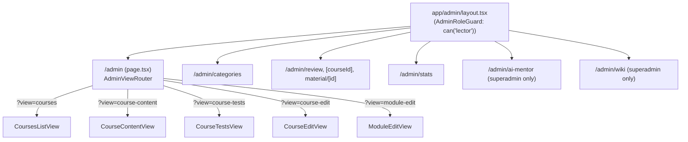

## Overview

The frontend (`frontend/`) is a Next.js 15 App Router application written in TypeScript with React 19. It is split into two route groups under `frontend/src/app`: `(main)`, the public/authenticated course-taking experience, and `admin`, the lector/guarantor/superadmin back office, plus a small `auth` route that completes the OAuth login handshake and an internal `api` route used for a couple of server-side proxy endpoints (avatar upload, contact form). All calls to the FastAPI backend go through a client generated from the backend's live OpenAPI schema — nothing under `frontend/src/api` is hand-written. Cross-cutting concerns (who is logged in, what role they have, how course/catalog data is fetched and cached, how editors autosave) live in a small set of hooks under `frontend/src/hooks`, built on top of primitives in `frontend/src/lib` (`keycloak.ts`, `api-client.ts`, `constants.ts`). Shared visual conventions for both areas are documented in [`frontend/UI-KIT.md`](../../frontend/UI-KIT.md) (referenced here as `UI-KIT.md`).

See [Authentication & Authorization](../architecture/auth-and-rbac.md) for the full Keycloak/PKCE token lifecycle and backend role model, [Backend REST API Surface](../backend/rest-api-surface.md) for the FastAPI routers this frontend consumes, and [Learning Model](../concepts/learning-model.md) for the course/module/block domain shown in the `(main)` route group.

## Generated OpenAPI client (`frontend/src/api`)

`frontend/src/api` is entirely generated output — `.openapi-generator-ignore` and the `.openapi-generator/` metadata directory mark it as machine-managed, and it must never be hand-edited. It is produced by the `generate:openapi` npm script in `frontend/package.json`:

```
npx @openapitools/openapi-generator-cli generate \
  -i http://localhost:8000/openapi.json \
  -g typescript-fetch \
  -o src/api \
  -c ../openapitools.json \
  --skip-validate-spec
```

This fetches the live OpenAPI schema from a running backend on `localhost:8000` (see [REST API Surface](../backend/rest-api-surface.md)) and runs it through the `typescript-fetch` generator, configured by `openapitools.json` (generator-cli version pin; both the repo root and `frontend/` carry a copy of this config). The output is one `*Api` class per backend router tag (`CoursesApi`, `ModulesApi`, `ActivitiesApi`, `AgentsApi`, `CatalogsApi`, `AuthenticationApi`, `EnrollmentsApi`, `FeedbacksApi`, `ResourcesApi`, `ReviewsApi`, `RatingsApi`, `CollectionsApi`, `SuperadminApi`, `ModuleTicketsApi`, `EditorImagesApi`, `UsersApi`), plus a `runtime.ts` fetch runtime, a `Configuration` class, per-schema `models/`, and a barrel `index.ts`. A companion `watch:openapi` script (via `chokidar-cli`) re-runs generation whenever files under `../api/**` (the backend's route/schema layer) change, so the client can be kept in sync during local development.

Because generation reads the backend's *current* schema, any backend request/response shape change (new field, renamed enum, new endpoint) requires re-running `generate:openapi` against a running backend before the frontend will type-check or compile against it — there is no independent source of truth for these types. `frontend/src/lib/api-client.ts` is the only place that is meant to instantiate and wrap the generated `*Api` classes for the rest of the app to consume; it constructs one shared `Configuration` with `basePath: API_BASE_URL` (`/api/backend`, see below) and an `authMiddleware` that calls `getValidAccessToken()` (from `keycloak.ts`) and attaches `Authorization: Bearer <token>` to every outgoing request, then exports singleton instances (`coursesApi`, `modulesApi`, `agentsApi`, …) and thin async wrapper functions (`getMe`, `getCourse`, `getCourseBlocks`, …) that the rest of the codebase imports instead of touching the generated classes directly.

Requests never target the backend origin directly from the browser: `next.config.ts` defines a `rewrites()` rule that maps `/api/backend/:path*` to `${NEXT_API_URL}/:path*` (defaulting to `http://localhost:8000`), and `API_BASE_URL`/`backendUrl()` in `frontend/src/lib/constants.ts` centralize that `/api/backend` prefix. This keeps the browser talking same-origin while Next.js proxies to the FastAPI service.

```mermaid
flowchart LR
    OAS["Backend /openapi.json"] -->|generate:openapi\n(typescript-fetch generator)| API["frontend/src/api\n(generated: apis/, models/, runtime.ts)"]
    API --> CLIENT["frontend/src/lib/api-client.ts\n(Configuration + authMiddleware + wrapper fns)"]
    CLIENT --> HOOKS["hooks: useCourseData, useCatalogData,\nuseCurrentUser, ..."]
    HOOKS --> PAGES["app/(main) & app/admin pages"]
    CLIENT -->|fetch /api/backend/*| REWRITE["next.config.ts rewrites()"]
    REWRITE --> BACKEND["FastAPI backend"]
```

## Shared hooks

`frontend/src/hooks` centralizes auth/role gating, data fetching, and editor persistence so pages don't reimplement them.

- **`useAuth`** (`frontend/src/hooks/useAuth.ts`) is the React-facing wrapper around the Keycloak/PKCE mechanics in `lib/keycloak.ts`. On mount it synchronously reads tokens from `localStorage` (via `useLayoutEffect`, to avoid a login/logout flash before paint), decodes the JWT with `parseJwt` into `AuthState.user`, and schedules a proactive refresh timer 60 seconds before expiry. It also refreshes on tab-visibility regain, and listens for two custom `window` events — `kc:logout` (forced logout from a failed refresh anywhere in the app) and `kc:login` (login completing in another mounted layout, e.g. after the OAuth callback navigates back) — so all mounted `useAuth` instances stay consistent. Refresh calls go through the module-level singleton `getValidAccessToken()` rather than calling `refreshTokens()` directly, so concurrent refreshes from multiple hook instances collapse into a single `POST /token` and a single failure doesn't wipe tokens that a sibling instance just refreshed. It exposes `{ isAuthenticated, user, accessToken, loading, login, logout }`.
- **`useCurrentUser`** (`frontend/src/hooks/useCurrentUser.ts`) fetches the backend `User` row (`getMe()` → `AuthenticationApi`) once `useAuth().isAuthenticated` is true, exposing `currentUser: UserResponse | null`, `loading`, an `isOwner(ownerId)` helper for ownership checks in the UI, and `refetch()`.
- **`useRole`** (`frontend/src/hooks/useRole.ts`) derives the current `AppRole` (`user < lector < guarantor < superadmin`) from `useAuth().user.role` and exposes `isLector`, `isGuarantor`, `isSuperAdmin`, and a generic `can(minRole)` built on `hasMinRole` from `lib/keycloak.ts`. This is the primary building block for RBAC gating in the UI — for example `AdminRoleGuard` (`frontend/src/components/admin/AdminRoleGuard.tsx`) wraps the entire `app/admin` layout and renders a 403 screen unless `can('lector')` is true, and `AdminSidebar` uses `can('superadmin')` / `isGuarantor` to conditionally show the AI Mentor/Wiki links and the "Ke schválení" (pending review) badge.
- **`useCourseData`** (`frontend/src/hooks/useCourseData.ts`) loads a full `Course` (with its `Module[]`) via `getCourse(courseId)` and manages the module-outline UI state used by the module-taking pages: `selectedModuleIndex`, `expandedOutlineItems`, and helpers to toggle/select. It keeps a module-level `Map<courseId, CourseData>` cache (`courseCache`) so switching between a course's tabs/phases renders instantly from cache while a fetch silently revalidates in the background; `invalidateCourseCache(courseId)` is called after content/test edits so the next open re-fetches fresh data instead of serving stale cache.
- **`useCatalogData`** (`frontend/src/hooks/useCatalogData.ts`) fetches the six catalog taxonomies used to tag/filter courses in parallel — `CourseBlock`, `CourseTarget`, `CourseSubject`, `CourseRequirement`, `CourseEqfLevel`, `CourseType` (via `CatalogsApi`) — and returns them together with a single `loading` flag, used by course create/edit forms and catalog filters.
- **`useAutosave`** (`frontend/src/hooks/useAutosave.ts`) is a generic debounced-autosave primitive used by content/test editors: given a `value` and a `save()` callback, it debounces saves by `delay` ms (default 500), tracks a `SaveStatus` (`'idle' | 'pending' | 'saving' | 'saved'`) for UI feedback, coalesces changes that happen *while* a save is in flight into one more save after it completes (rather than dropping or racing them), and flushes any unsaved change on unmount so in-progress edits aren't lost when navigating away. It compares JSON-serialized snapshots to decide whether there is anything new to persist.

`frontend/src/hooks/index.ts` re-exports `useDebounce`, `useAutosave`, `useAdminNavigation`, `useAuth`, and `useRole` as the hook barrel; `useCurrentUser`, `useCourseData`, and `useCatalogData` are imported directly from their files.

## Route map: `app/(main)` — public/authenticated course-taking area

`app/(main)/layout.tsx` wraps every route in this group with the shared `Header`/`Footer` and a centered `max-width: 1440px` content column; it applies no role gate, so unauthenticated visitors can browse the catalog while pages that need a signed-in user check `useAuth`/`useCurrentUser` themselves.

| Route | Purpose |
| --- | --- |
| `/` (`page.tsx`) | Landing page — course highlights, about/contact sections. |
| `/courses` (`courses/page.tsx`, `CoursesContent.tsx`) | Public course catalog, filterable by the `useCatalogData` taxonomies. |
| `/courses/[slug]` | Course detail/landing page for a single course (enroll, view outline). |
| `/modules/[slug]` | The module-taking experience: a single client page (`ModulePage`) that drives three tabs over one `Module` — **`prirucka`** (handbook/learn, rendered content blocks), **`procvicovani`** (`PracticeTab`, practice questions) and **`test`** (`AssessmentTab`, graded assessment) — backed by `useCourseData`-style loading of the course/module via `getModule`/`getCourse`, with an embedded AI tutor chat (`AiTutorChat`) and tab/scroll progress persisted to `sessionStorage` per module. |
| `/moje-kurzy` | "My courses" dashboard — enrollment cards, progress heatmap, quick stats, recommended courses. |
| `/moje-tikety`, `/moje-tikety/[id]` | Student support/module tickets list and detail. |
| `/tutor` | AI tutor entry point (placeholder page as of writing). |
| `/profil` | User profile — display name, AI tone/expression preferences (via `updateProfile*` wrappers). |
| `/odmeny` | Rewards/gamification page (placeholder page as of writing). |
| `/verejna-databaze`, `/verejna-databaze/[id]` | Public resource/collection database (browse public resources and collections, plus a "my collection" management view) — see [Public Resource Library](../concepts/public-resource-library.md). |
| `/changelog` | Renders the project changelog fetched from GitHub wiki markdown. |

## Route map: `app/admin` — lector/guarantor/superadmin back office

`app/admin/layout.tsx` wraps the whole subtree in `AdminRoleGuard`, which blocks access (rendering a 403 screen with a login CTA) unless `useAuth().isAuthenticated` and `useRole().can('lector')` are both true — the entire admin area, not just individual pages, is role-gated at the layout boundary. Inside the guard, `AdminSidebar` renders role-conditional navigation: base items for every lector (`Kurzy`, `Statistiky`), a "Ke schválení" (pending review) item with a live badge count for guarantors+, and `AI Mentor`/`Wiki agent` links for superadmins only.

Course/module CRUD is not split across many route folders; instead `/admin` (`page.tsx` → `AdminViewRouter`) renders one of several view components (`CoursesListView`, `CourseContentView`, `CourseTestsView`, `CourseSummaryView`, `CourseEditView`, `CourseUploadView`, `CourseAICreateView`, `ModuleEditView`) selected by an `AdminView` string kept in the `?view=` query parameter, managed by `useAdminNavigation`. That hook parses `view`/`courseId`/`moduleId` from `useSearchParams()` and exposes `navigate`/`goToCourseContent`/`goToCourseEdit`/etc. helpers that push shallow URL updates, so back/forward and page refresh preserve which course/module/view is open without a full page reload.

The remaining admin routes are separate folders, each thin — a `page.tsx` that renders one view component from `@/components/admin/views`:

| Route | View component | Purpose |
| --- | --- | --- |
| `/admin/categories` | `CategoriesListView` | Manage the catalog taxonomies (blocks, targets, subjects, requirements, EQF levels, types) consumed by `useCatalogData`. |
| `/admin/review`, `/admin/review/[courseId]`, `/admin/review/material/[id]` | `ReviewListView`, `ReviewCourseView`, `ReviewMaterialView` | Guarantor queue for approving/rejecting submitted courses and public-resource materials. |
| `/admin/stats` | stats views under `components/admin/stats` | Lector/superadmin usage and progress statistics. |
| `/admin/ai-mentor` | `AiMentorView` | Superadmin console for the AI mentor/tutor agent configuration. |
| `/admin/wiki` | `WikiSyncView` | Superadmin console that triggers/monitors the OpenWiki agent sync for this documentation set. |



## OAuth callback route: `app/auth/callback`

`/auth/callback` (`app/auth/callback/page.tsx`) is the PKCE authorization-code redirect target registered with Keycloak (built by `getCallbackUrl()`/`buildLoginUrl()` in `lib/keycloak.ts`). It reads `code`/`error`/`error_description` from the query string inside a `Suspense` boundary (required because `useSearchParams()` needs one), calls `exchangeCodeForTokens(code)` to trade the code plus the stashed PKCE verifier for tokens, persists them via `storeTokens()` (which also dispatches the `kc:login` event `useAuth` listens for), fires a best-effort `POST /api/v1/auth/sync` so the backend syncs the user's role from Keycloak into its own `User` table, and then `router.replace("/")`. On any error it renders an inline error card with a way back to the home page instead of retrying automatically. See [Authentication & Authorization](../architecture/auth-and-rbac.md) for the full token/role sync flow this route participates in.

## Design system conventions

`frontend/UI-KIT.md` is the source of truth for UI conventions shared by both `app/(main)` and `app/admin`: it documents the shadcn/Base UI primitives generated into `src/components/ui-kit/` (never hand-edited — regenerated via `npx shadcn@latest add <component>`), the project-level component barrel at `src/components/ui/`, the `Button` variant/size vocabulary (`variant`: `default | outline | secondary | ghost | destructive | warning | brand | link`; `size`: `default | xs | sm | lg | xl | icon...`), and the live `/ui-kit` showcase route (`app/ui-kit/page.tsx`) that renders every kit variant. New pages in either area are expected to import shared primitives from the `@/components/ui` barrel rather than styling raw HTML elements, and to follow the design-token conventions in `src/app/globals.css`.
