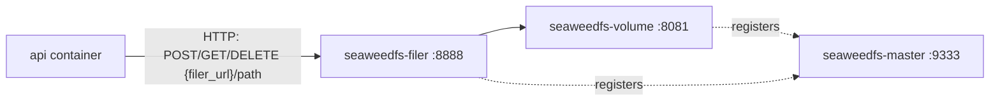
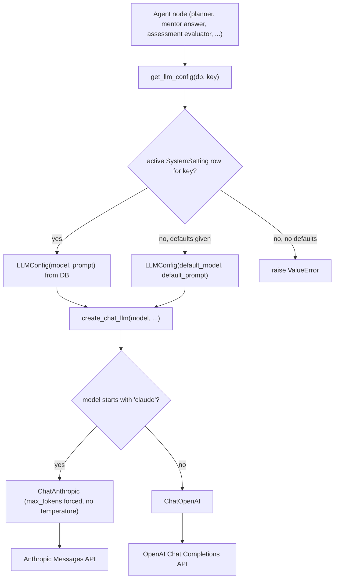

## Overview

The backend does not own three classes of infrastructure it depends on at
runtime:

- **Keycloak** — the OpenID Connect identity provider used for login, token
  validation, and role lookups.
- **SeaweedFS** — the object store backing course files, rich-text editor
  images, and public-resource attachments.
- **Anthropic (Claude) / OpenAI (GPT)** — the LLM providers behind every
  LangGraph agent (course generation, mentor chat, assessment/practice
  question generation and evaluation, wiki mentor, the SQL agent).

All three are external processes/services the `api` container talks to over
the network (or, for the LLM APIs, over the public internet); none of them are
implemented inside this repository. This page documents the client-side
integration code, configuration, and failure semantics for each. For the wider
service topology see [System Overview](../architecture/system-overview.md);
for the end-to-end login/role flow see
[Authentication & Authorization](../architecture/auth-and-rbac.md); for
environment variables and compose profiles see
[Deployment and Configuration](../operations/deployment-and-configuration.md).

## Keycloak (identity provider)

### Realm and client provisioning

`compose.yml` runs `quay.io/keycloak/keycloak:26.4.0` with
`start-dev --import-realm`, wired to the same Postgres instance as the
application (`KC_DB_URL=jdbc:postgresql://db:5432/<POSTGRES__DB>?currentSchema=keycloak`),
and mounts [`infra/keycloak/praktikai-dev-realm.json`](../../infra/keycloak/praktikai-dev-realm.json)
read-only into `/opt/keycloak/data/import/`. On startup Keycloak imports this
file into a `praktikai-dev` realm (`registrationAllowed`,
`loginWithEmailAllowed`, a custom `praktik-ai` login theme). The realm defines:

- **Four realm roles**: `user` (default), `lector`, `guarantor`, `superadmin`
  — the same set enforced by the backend's RBAC (see
  [Authentication & Authorization](../architecture/auth-and-rbac.md)).
- **Client `app`** — confidential, `client-secret` auth, service accounts
  enabled, `directAccessGrantsEnabled` (password grant), used by the
  *backend* both to validate tokens and to look up roles via the Admin API.
  Its service account (`service-account-app`) is granted the
  `realm-management` client roles `view-users` and `view-realm`, which is the
  minimum needed to read other users' realm role assignments.
- **Client `praktik-ai-app`** — public SPA client, PKCE (`S256`), standard
  (authorization-code) flow only, used by the *frontend* for interactive
  login.

The backend's Keycloak connection parameters (`server_url`, `realm_name`,
`client_id`, `client_secret`) are a nested pydantic settings group
(`KeycloakSettings` in `backend/api/config.py`), populated from
`KEYCLOAK__*` environment variables (`env_nested_delimiter="__"`), which must
match the `app` client's realm/id/secret in the imported realm JSON.

### Token exchange and validation: `KeycloakOpenID`

`backend/api/dependencies.py` defines an `Auth` class that wraps
`python-keycloak`'s `KeycloakOpenID` client, constructed once at import time
as the module-level singleton `auth = Auth()`. It is used for two things:

- `Auth.get_token(username, password)` — calls `keycloak_openid.token(...,
  grant_type="password")` (the Resource Owner Password Credentials grant,
  enabled on the `app` client) for the backend's own `/api/v1/auth/token`
  endpoint; `KeycloakAuthenticationError` maps to HTTP 401.
- `Auth.get_current_user(token, db)` — the `CurrentUser` FastAPI dependency
  used across routers. It calls `keycloak_openid.introspect(token)` (rejects
  inactive/expired tokens with 401) and then `keycloak_openid.userinfo(token)`
  to obtain the token subject (`sub`), email, and display name. **The JWT's
  embedded roles are never trusted**; only `sub`/`email`/`name` are read from
  it. `KeycloakConnectionError`/`KeycloakAuthenticationError` during this call
  surface as HTTP 500 ("Autentizace selhala nebo Keycloak není dostupný"),
  meaning a Keycloak outage makes every authenticated backend endpoint fail
  closed rather than degrade.
- `Auth.sync_user_from_token(token_str, db)` — same `userinfo()` lookup, used
  by `/api/v1/auth/sync` to eagerly create/update the DB `User` row right
  after the frontend completes its OIDC code exchange.

See [Authentication & Authorization](../architecture/auth-and-rbac.md) for the
full login-to-role-resolution sequence and the DB `User`/role model.

### Role lookups: `KeycloakAdmin` (client-credentials service account)

Because JWT roles are not trusted, roles are instead pulled from Keycloak's
Admin REST API through `python-keycloak`'s `KeycloakAdmin`, authenticated via
the OAuth2 client-credentials grant on the same `app` client (its service
account):

```python
connection = KeycloakOpenIDConnection(
    server_url=settings.keycloak.server_url,
    client_id=settings.keycloak.client_id,
    client_secret_key=settings.keycloak.client_secret,
    realm_name=settings.keycloak.realm_name,
)
KeycloakAdmin(connection=connection)
```

`_fetch_roles_from_admin_api(user_sub)` calls
`admin.get_realm_roles_of_user(user_id=sub)`, maps the returned realm role
names to the `UserRole` enum via `_KC_ROLE_MAP`, and resolves the *highest*
role present using a fixed priority order
(`user < lector < guarantor < superadmin`, `_ROLE_PRIORITY`/
`_resolve_highest_role`). **On any exception (Admin API unreachable, service
account misconfigured, etc.) it logs and falls back to `UserRole.user`** —
this fails safe (least privilege) rather than blocking the request, unlike
the harder failure in `get_current_user`'s own introspection call.

Role sync is not done on every request: `get_current_user` only re-invokes the
Admin API lookup when a user row is first created, or when
`now - user.last_synced_at > _ROLE_SYNC_TTL` (5 minutes), caching the resolved
role on the `User` row in between. A role change made in Keycloak is
therefore visible to the backend within at most 5 minutes (or immediately
after a fresh `/auth/sync` call).

### Operational implications

- Keycloak being down blocks **all** authenticated traffic (introspection
  fails → 500), not just login.
- The Keycloak Admin API being down (but the OIDC endpoints still up) does
  *not* block requests — it silently downgrades any user whose 5-minute role
  cache has expired back to `UserRole.user` until the Admin API recovers.
- `compose.yml` starts `keycloak` only after `api` reports healthy
  (`depends_on: api: condition: service_healthy`); `keycloak` itself has no
  Docker healthcheck defined, so nothing in compose currently blocks on
  Keycloak's own readiness before other services start.

## SeaweedFS (object storage)

### Topology

SeaweedFS runs as three independent containers of the same
`chrislusf/seaweedfs:latest` image in `compose.yml`, each with a distinct
role/command:

- `seaweedfs-master` (`master -mdir=/data -port=9333`) — the coordination
  node volume servers register with.
- `seaweedfs-volume` (`volume -mserver=seaweedfs-master:9333 -port=8081`) —
  the actual block/chunk storage, registers itself with the master.
- `seaweedfs-filer` (`filer -master=seaweedfs-master:9333 -port=8888`) — a
  filesystem-style HTTP API layered on top of the volume servers; this is the
  **only** SeaweedFS role the backend talks to.


*The backend only ever calls the filer's HTTP API; the filer transparently fans requests out to volume servers, which register themselves with the master.*

Configuration lives in `SeaweedFSSettings` (`backend/api/config.py`):
`master_url` (default `http://seaweedfs-master:9333`, currently unused by the
backend's own code — it is only meaningful if something talks to the master
directly) and `filer_url` (default `http://seaweedfs-filer:8888`), overridable
via `SEAWEEDFS__MASTER_URL` / `SEAWEEDFS__FILER_URL`.

### Client helpers: `backend/api/storage/seaweedfs.py`

Three synchronous functions, each opening its own short-lived `httpx.Client`
and building a URL via `_filer_url(path)` (`{filer_url}/{path.lstrip("/")}`):

- `upload_file(remote_path, content, filename, content_type)` — `POST`s a
  `multipart/form-data` body (`files={"file": (filename, content,
  content_type)}`), matching the filer's expected `curl -F "file=@..."`
  contract, and returns the full filer URL (which callers persist as
  `file_path` in the DB).
- `download_file(remote_path)` — `GET`s the file and returns raw bytes.
- `delete_file(remote_path)` — `DELETE`s the file.

All three call `response.raise_for_status()` and let `httpx.HTTPStatusError`
propagate to the caller; there is no retry, caching, or presigned-URL
mechanism — every read/write is a live round trip to the filer.

### Callers / features backed by SeaweedFS

| Feature | Path convention | Module |
|---|---|---|
| Course file uploads | `courses/{course_id}/{filename}` | `api/src/courses/controllers/create.py` (`upload_course_file`) |
| Course file deletion (cascades on hard course delete) | same as above | `api/src/courses/controllers/delete.py` (`delete_course`, `delete_course_file`) |
| Rich-text editor image uploads | `editor-images/{uuid}{ext}` | `api/src/editor_images/controllers.py` |
| Public resource attachments | (mirrors course file convention) | `api/src/publicDB/resources/controllers/create.py` / `delete.py` |
| Course-generator agent reading source files back out | reads `course_input.files` paths | `agents/course_generator/nodes/load_data.py` (`load_data_node`) |

Notable behavior:

- `upload_editor_image` validates content type against an allow-list
  (`image/jpeg|png|webp|gif|svg+xml`) and a 10 MB size cap *before* calling
  SeaweedFS; `get_editor_image` treats a `404`/other `HTTPStatusError` from
  `download_file` as "image not found" (HTTP 404).
  It also guards `filename` against path traversal (`/`, `..`) before building
  the remote path.
- `delete_course` (hard delete, draft courses only) iterates every
  `CourseFile` and calls `seaweedfs.delete_file`, but only logs a warning on
  failure rather than aborting — so a partially-unreachable SeaweedFS can
  leave orphaned blobs on the filer while the DB rows are still removed.
- `load_data_node` in the course-generation LangGraph graph downloads every
  source file the lecturer attached, writes it to a temporary file, and hands
  it to a `DataLoader` for text extraction; if *no* file can be loaded (all
  downloads fail, or the course has no files) the node raises and the whole
  course-generation run fails — i.e. SeaweedFS availability is a hard
  dependency for course generation, not just file upload/download endpoints.

## LLM provider abstraction (`agents/base/llm.py`)

Every LangGraph agent node in the backend obtains its chat model through the
same two functions rather than instantiating `ChatAnthropic`/`ChatOpenAI`
directly:

- **`get_llm_config(db, key, *, default_model=None, default_prompt=None)`** —
  looks up an active `SystemSetting` row by `key` (e.g. `"course_planner"`,
  `"course_summarizer"`, or per-node keys used by mentor/assessment/practice
  agents) and returns an `LLMConfig(model, prompt)`. `SystemSetting` is a
  Super-Admin-managed table (`backend/api/models.py`) holding the model name
  and prompt text per logical role, letting operators change models/prompts
  without a redeploy. If no active row exists and no `default_model`/
  `default_prompt` were supplied, it raises `ValueError` — callers typically
  pass hardcoded defaults (e.g. `"gpt-4o"`, `"gpt-5.2"`) so the system keeps
  working before an admin has configured that key.
- **`create_chat_llm(model, *, temperature=None, max_tokens=None)`** — picks
  the LangChain chat wrapper by a simple name-prefix check: any `model`
  starting with `"claude"` returns `ChatAnthropic`; everything else returns
  `ChatOpenAI`.


*Every agent node resolves its model/prompt from the DB (with hardcoded fallbacks), then `create_chat_llm` branches to the Anthropic or OpenAI LangChain wrapper by name prefix.*

Anthropic-specific handling in `create_chat_llm` exists because of two
observed provider quirks (documented inline in the source):

- Current-generation Claude models reject a `temperature` parameter with
  HTTP 400, so `temperature` is **never** forwarded to `ChatAnthropic` (it is
  only applied to `ChatOpenAI`).
- `langchain-anthropic` derives a default `max_tokens` from an internal
  per-model table that can silently fall back to 4096 tokens for models it
  doesn't recognize (e.g. newly released Claude models), truncating
  structured output such as generated course modules. `create_chat_llm`
  therefore always sets `max_tokens` explicitly — `DEFAULT_ANTHROPIC_MAX_TOKENS
  = 16000` unless the caller passes a larger value (e.g. the course planner
  node requests 64000) — and switches on `streaming=True` whenever the
  resolved `max_tokens` exceeds the default, to avoid the request timing out
  before a large non-streamed response finishes generating.

### Callers

`create_chat_llm`/`get_llm_config` are used by every agent that talks to an
LLM: `agents/course_generator/nodes/{planner,summarize}.py`,
`agents/mentor/nodes/{generate_answer,rerank}.py`,
`agents/assessment_generator/nodes/generate_question.py`,
`agents/assessment_evaluator/nodes/evaluate_answer.py`,
`agents/practice_question_generator/nodes/generate_question.py`,
`agents/practice_answer_evaluator/nodes/evaluate_answer.py`,
`agents/sql_agent/graph.py`, and `agents/wiki/mentor/nodes/generate_answer.py`.
Each passes its own hardcoded default model/prompt and its own
`temperature`/`max_tokens`, but all funnel through this one abstraction, so
switching a given agent role between Claude and GPT is a `SystemSetting`
update, not a code change.

### API keys

Unlike Keycloak and SeaweedFS, LLM provider credentials are **not** part of
the backend's pydantic `Settings` (`backend/api/config.py`) at all. `ChatAnthropic`
and `ChatOpenAI` (via `langchain-anthropic`/`langchain-openai`, which delegate
to the vendor SDKs) read `ANTHROPIC_API_KEY` and `OPENAI_API_KEY` directly
from the process environment if not passed explicitly, and `create_chat_llm`
never passes them explicitly. Both variables are set in the repo's top-level
`.env` (see `.env_example`) and loaded into the `api` container by
`compose.yml`'s `env_file: .env` — there is no `KEYCLOAK__*`/`SEAWEEDFS__*`-style
nested settings model for them, so misconfiguration surfaces only as a runtime
authentication error from the Anthropic/OpenAI SDK when a node first tries to
call the model, not as a startup-time configuration error.

## Cross-cutting operational notes

All three integrations are **hard runtime dependencies**, not optional
enhancements:

- **Course generation** (the `course_generator` LangGraph graph) needs
  SeaweedFS reachable to load source files (`load_data_node`) *and* an LLM
  provider reachable for planning/summarization/module generation — either
  being down fails the whole generation run.
- **Mentor chat** (`agents/mentor/*`, `agents/wiki/mentor/*`) needs an LLM
  provider for answer generation/reranking; it does not depend on SeaweedFS.
- **File upload features** (course files, editor images, public resource
  attachments) need SeaweedFS's filer reachable; they do not depend on the
  LLM providers.
- **Every authenticated API request** needs Keycloak's OIDC endpoints
  reachable (token introspection/userinfo); most also depend on the DB-cached
  role rather than a live Admin API call, so a Keycloak Admin API outage is
  far less disruptive than an OIDC endpoint outage.

Of these, only `api` and `db` have an explicit Docker healthcheck in
`compose.yml` today (`api`'s `GET /health`, `db`'s `pg_isready`); `keycloak`
and the three `seaweedfs-*` services have no healthcheck defined, so compose
orders their startup (`depends_on`) but does not gate on their readiness —
operators should verify Keycloak and SeaweedFS are actually serving before
relying on login, file upload, or course-generation features in a freshly
started stack.
