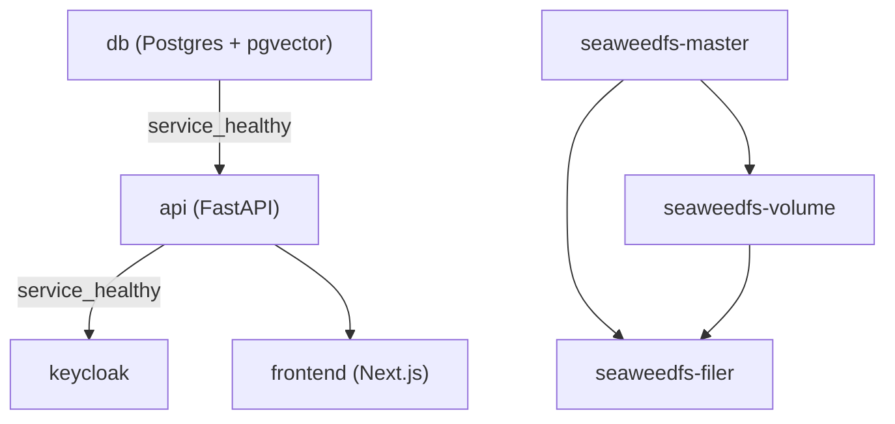

## Overview

The system runs as a set of `docker compose` services (frontend, API, Postgres,
Keycloak, SeaweedFS). Configuration is supplied entirely through environment
variables read by `pydantic-settings`, grouped into nested settings classes.
There is no schema migration framework (no Alembic): the API creates its
schema from the SQLAlchemy models on every startup, and then seeds reference
data and default LLM/system settings. The `migrations/` directory holds
separate, hand-written SQL scripts for schema changes that were made directly
against Postgres outside that ORM bootstrap; these must be manually
coordinated with `models.py`.

## Quick local run

```bash
cp .env_example .env
# fill in secrets (OPENAI_API_KEY, Keycloak client secret, etc.)
docker compose up -d
```

Once the stack is healthy:

| Service | URL |
| --- | --- |
| API | http://localhost:8000 |
| API docs (Swagger) | http://localhost:8000/ |
| Frontend | http://localhost:3000 |
| Keycloak | http://localhost:8080 |
| SeaweedFS Filer | http://localhost:8888 |

The `Makefile` also exposes a `backend-dev` target that brings up only the
backend-facing services (`api db keycloak seaweedfs-master seaweedfs-filer
seaweedfs-volume`, rebuilt) for local backend iteration, and a `db` target
that starts just the database.

## Compose services, ports, and start order

`compose.yml` (see [System Overview](../architecture/system-overview.md) for
how these map onto the runtime architecture) defines these services:

| Service | Image / build | Ports | Healthcheck | Depends on |
| --- | --- | --- | --- | --- |
| `db` | `pgvector/pgvector:0.8.1-pg18-trixie` | `5433:5432` | `pg_isready -d $POSTGRES__DB -U $POSTGRES__USER` | — |
| `api` | `infra/docker/backend.Dockerfile` | `8000:8000` | `GET http://localhost:8000/health` via `urllib` | `db` (`service_healthy`) |
| `keycloak` | `quay.io/keycloak/keycloak:26.4.0` | `8080:8080`, `9000:9000` | none defined | `api` (`service_healthy`) |
| `frontend` | `infra/docker/fe.Dockerfile` | `3000:3000` | none defined | `api` (no health condition) |
| `seaweedfs-master` | `chrislusf/seaweedfs:latest` | `9333:9333` | none | — |
| `seaweedfs-volume` | `chrislusf/seaweedfs:latest` | `8081:8081` | none | `seaweedfs-master` |
| `seaweedfs-filer` | `chrislusf/seaweedfs:latest` | `8888:8888` | none | `seaweedfs-master`, `seaweedfs-volume` |

Start order is therefore: **`db` becomes healthy → `api` starts (and must
itself become healthy) → `keycloak` starts once `api` is healthy**; `frontend`
only waits for `api` to have started (no healthy condition). This ordering
exists because `keycloak` is configured to use the same Postgres instance as
the backend (`KC_DB_URL=jdbc:postgresql://db:5432/${POSTGRES__DB}?currentSchema=keycloak`),
and the `keycloak` schema in that database is created by the API/seed
bootstrap (`CREATE SCHEMA IF NOT EXISTS keycloak;`, run both by
`infra/docker/init-db.sql` and idempotently inside `seed_db()`) before
Keycloak's own `start-dev --import-realm` runs against it. The SeaweedFS
trio (master/volume/filer) is independent infrastructure used for file
storage; only the filer URL is consumed by the backend.



*Compose dependency and start-order graph: db must be healthy before api starts; keycloak waits for api's healthcheck; frontend only waits for api to start.*

The API healthcheck hits `GET /health` (defined in `backend/api/main.py`),
which simply exercises the DB session dependency and returns `{"message":
"ok"}` — a passing healthcheck therefore also implies the database connection
and schema bootstrap succeeded, since schema creation and seeding run at
import time before the app object is even fully constructed (see below).

## Configuration: environment variables and nested settings

Configuration is defined in `backend/api/config.py` using
`pydantic-settings`. The top-level `Settings` object composes four nested
settings classes, and `model_config = SettingsConfigDict(env_nested_delimiter="__", case_sensitive=False, extra="ignore")`
means each nested field is populated from an environment variable named
`<GROUP>__<FIELD>` (double underscore), case-insensitively. Unknown extra
environment variables are ignored rather than rejected.

| Settings class | Env prefix | Required fields | Optional / defaulted fields |
| --- | --- | --- | --- |
| `PostgresSettings` | `POSTGRES__` | `HOST`, `PORT`, `USER`, `PASSWORD`, `DB` (all required, no defaults) | — |
| `KeycloakSettings` | `KEYCLOAK__` | `SERVER_URL`, `REALM_NAME`, `CLIENT_ID`, `CLIENT_SECRET` (all required) | — |
| `SeaweedFSSettings` | `SEAWEEDFS__` | — | `MASTER_URL` (default `http://seaweedfs-master:9333`), `FILER_URL` (default `http://seaweedfs-filer:8888`) |
| `WikiSettings` | `WIKI__` | — | `SYNC_INTERVAL_HOURS` (default `12`), `REPO_URL` (default the project's GitHub wiki), `LOCAL_PATH` (default `../wiki_data`) |

Because `postgres` and `keycloak` have no field defaults, the process fails to
start if any of their variables are missing. `seaweedfs` and `wiki` are
optional blocks with sane defaults matching the compose service names, so a
bare-minimum `.env` only needs to set the Postgres and Keycloak groups plus
any provider API keys used by the agents.

`.env_example` documents the full variable set consumed across the stack,
including variables outside the nested `Settings` model:

- `POSTGRES__HOST` / `POSTGRES__PORT` / `POSTGRES__USER` / `POSTGRES__PASSWORD` / `POSTGRES__DB` — used both by the backend's `PostgresSettings.get_connection_string()` (a `postgresql+psycopg://` URL) and directly by the `db` and `keycloak` compose services.
- `KC_BOOTSTRAP_ADMIN_USERNAME` / `KC_BOOTSTRAP_ADMIN_PASSWORD` — Keycloak's own bootstrap admin credentials, consumed only by the `keycloak` container, not by `pydantic-settings`.
- `KEYCLOAK__SERVER_URL` / `KEYCLOAK__REALM_NAME` / `KEYCLOAK__CLIENT_ID` / `KEYCLOAK__CLIENT_SECRET` — backend-side OIDC client used to validate tokens issued by the `keycloak` service (see [External Services](../integrations/external-services.md)).
- `SEAWEEDFS__MASTER_URL` / `SEAWEEDFS__FILER_URL` — object storage endpoints used for file attachments.
- `OPENAI_API_KEY` (and comparable provider keys used by agent code) — read outside the `Settings` model, directly by the LLM client libraries.
- `WIKI__SYNC_INTERVAL_HOURS` / `WIKI__REPO_URL` / `WIKI__LOCAL_PATH` — control the background job that periodically syncs the GitHub wiki repo into `wiki_data/`.
- `NEXT_PUBLIC_KEYCLOAK_URL` / `NEXT_PUBLIC_KEYCLOAK_REALM` / `NEXT_PUBLIC_KEYCLOAK_CLIENT_ID` / `NEXT_API_URL` — frontend build-time args baked into the Next.js bundle by `infra/docker/fe.Dockerfile`, not read via `pydantic-settings`.

All services load `.env` via `env_file: .env` in `compose.yml`; the `frontend`
build additionally re-declares the `NEXT_PUBLIC_*`/`NEXT_API_URL` values as
Docker build `args` because Next.js inlines `NEXT_PUBLIC_*` variables at
build time, not at container start.

## Database bootstrap: schema creation and seeding

There is **no Alembic** (or other migration framework) driving the primary
schema lifecycle. Instead, `backend/api/database.py` defines `init_db()`,
which:

1. Optionally creates the `pg_trgm` Postgres extension (used for trigram
   indexes such as `ix_course_title_trgm`), tolerating a `ProgrammingError`
   if it already exists or cannot be created.
2. Calls `Base.metadata.create_all(bind=conn)`, which inspects every
   SQLAlchemy model imported under `api.models` and issues `CREATE TABLE IF
   NOT EXISTS`-equivalent DDL for any table not yet present.

`backend/api/main.py` calls `init_db(create_extensions=True)` and then
`seed_db()` at **module import time** — i.e. before the `FastAPI` app object
is constructed and before the `/health` endpoint or the app's `lifespan`
context (which only starts/stops the wiki sync scheduler) run. This means
schema creation and seeding happen synchronously on every API process start,
including container restarts; `create_all` is idempotent (skips existing
tables), and `seed_db()` guards each catalog with a row-count check.

`backend/api/seed.py`'s `seed_db()`:

- Ensures the `keycloak` Postgres schema exists (`CREATE SCHEMA IF NOT EXISTS
  keycloak;`), independent of and redundant with `infra/docker/init-db.sql`
  (which does the same thing once, on first Postgres container
  initialization).
- Populates a fixed set of default reference catalogs — `CourseBlock`,
  `CourseTarget`, `CourseSubject`, `CourseRequirement`, `CourseEqfLevel`,
  `CourseType`, `NeuroPrinciple`, `CrossSubject`, `BloomLevel`,
  `KrauuCompetence` — each only if its table is currently empty, so
  administrator edits made after the initial seed are preserved across
  restarts. `KrauuCompetence` is seeded in two passes (top-level areas whose
  `code` ends in `.0`, then children linked via `parent_id`) to satisfy the
  self-referential foreign key.
- Populates `SystemSetting` rows (one per LLM-backed agent step: e.g.
  `course_summarizer`, `mentor_answer`, `mentor_reranker`, and the
  assessment/practice evaluators) from the module-level `SYSTEM_SETTINGS`
  list, again only when the table is empty. Each entry carries a `key`,
  display `name`, `model` identifier, `prompt` text, and `description`; these
  are the runtime-configurable model/prompt pairs the agents in
  `backend/agents` read at runtime instead of hard-coding prompts (see
  [System Overview](../architecture/system-overview.md) and
  [Data Model](../architecture/data-model.md) for how `SystemSetting` is
  consumed).

Because `seed_db()` only inserts into empty tables, editing `SYSTEM_SETTINGS`
in `seed.py` (e.g. tuning a prompt or swapping a model) has **no effect** on
an already-seeded database — the changed values are only used for brand-new
deployments.

## Updating system settings without reseeding

`backend/scripts/update_system_settings.py` is the operational tool for
propagating `SYSTEM_SETTINGS` changes into an already-running database
without wiping or reseeding everything else. It:

- Iterates every entry in `SYSTEM_SETTINGS` (imported directly from
  `api.seed`), optionally filtered to an explicit set of `key`s.
- For each key, looks up the active `SystemSetting` row
  (`is_active.is_(True)`); if missing, inserts it; if present, compares
  `name`, `model`, `prompt`, `description` and overwrites only the fields
  that changed, logging what it did (`[+]` created, `[~]` updated, `[=]`
  unchanged).
- Commits once at the end.

It is invoked from the repo root via the `Makefile`:

```bash
make update-settings                       # sync every key
make update-settings KEYS=course_planner    # sync only selected key(s)
```

which runs `docker compose exec api python -m scripts.update_system_settings
$(KEYS)` inside the already-running `api` container. This is the intended way
to roll out prompt/model tuning to production-like environments: it avoids a
full reseed (which would be a no-op anyway once tables are non-empty) and
avoids hand-editing rows via the admin dashboard, though it explicitly
**overwrites any such hand-edits** made through the dashboard for the
affected keys.

## Ad-hoc SQL migrations

The `migrations/` directory is **not** wired into any automatic migration
runner (no Alembic, no compose step executes it). It is a manually-curated
history of one-off SQL scripts written directly against Postgres, used when a
schema change was rolled out to a running database out-of-band from an
application redeploy — for example, adding columns/foreign keys to an
existing table, or bulk-creating new tables/seed rows that a later
`models.py`/`seed.py` version also expects. Present examples:

- `migrations/0001_pubresource_add_eqf_level_course_type.sql.sql` — adds
  nullable `eqf_level_id`/`course_type_id` columns to `pub_resource`,
  backfills them from default catalog rows, then tightens the columns to
  `NOT NULL` with foreign keys.
- `migrations/0002_changes_since_petricek_d1f773c.sql` — a larger,
  explicitly idempotent script (safe to re-run) that creates several new
  tables (`neuro_principle`, `krauu_competence`, `bloom_level`,
  `cross_subject`, plus their join tables), seeds their catalogs only into
  empty tables, adds new columns to `course`/`module`, renames
  `course_block` codes, and backfills a default value into existing modules.
- `migrations/migration_script.sql` — creates the `pub_resource*` table
  family (public/shared resources, forks, files, ratings) and associated
  enum types, guarded with `CREATE TYPE ... EXCEPTION WHEN duplicate_object`
  and `CREATE TABLE IF NOT EXISTS` for idempotency.

These scripts exist precisely because `Base.metadata.create_all` only ever
*adds new tables* — it never alters existing tables (adds/drops columns,
changes types, adds constraints) or renames/backfills data. Any schema change
in `backend/api/models.py` that is not a brand-new table (new column on an
existing table, new constraint, data backfill, column rename) requires a
corresponding hand-written script here, applied manually (e.g. `psql` against
the running `db` service) in careful coordination with the model change —
there is no tooling that verifies the live schema matches `models.py`, and a
mismatch will surface only as a runtime SQL error the first time the
misaligned column/table is touched. When changing `models.py` in a way that
alters an existing table, treat `migrations/` as the required companion
change and keep the two in step for every environment that already has data.

## Related pages

- [System Overview](../architecture/system-overview.md) — how the API,
  agents, and infrastructure services fit together at runtime.
- [Data Model](../architecture/data-model.md) — the SQLAlchemy models whose
  `Base.metadata` drives schema creation, and the catalogs seeded here.
- [External Services](../integrations/external-services.md) — Keycloak,
  SeaweedFS, and LLM provider integration details referenced by the
  `KeycloakSettings`/`SeaweedFSSettings` configuration groups.
