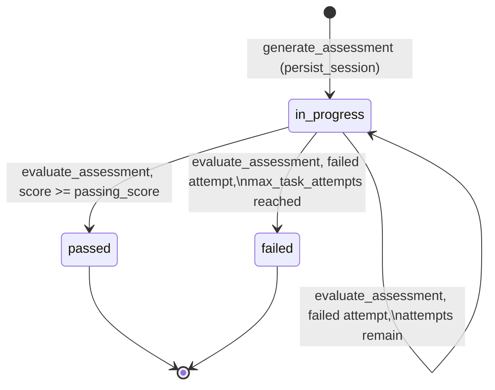
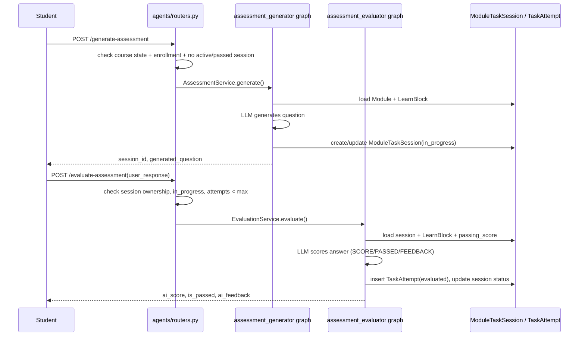
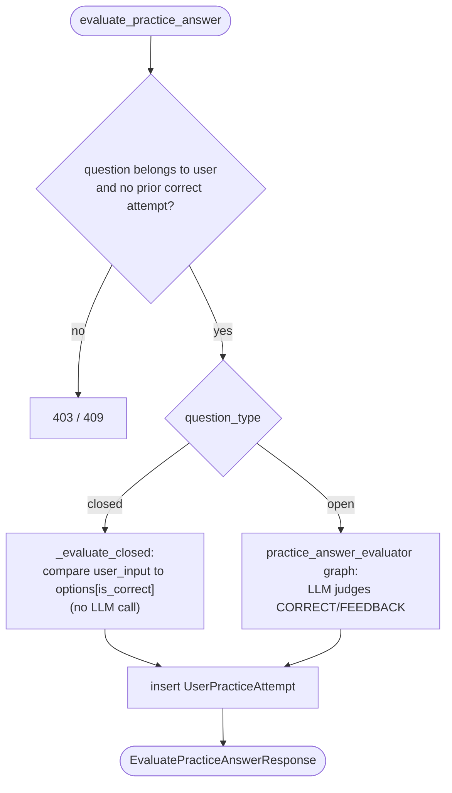
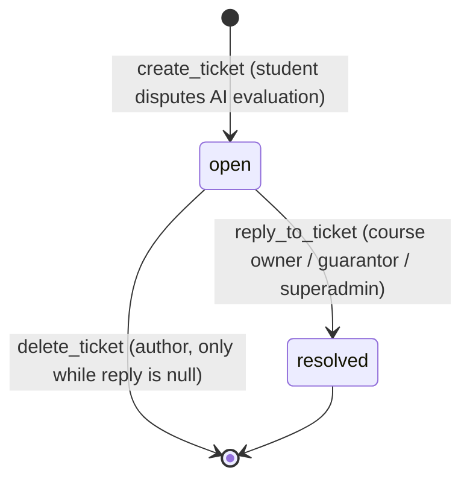

## Overview

This page covers the two AI-graded student-facing loops that operate at module
level — the pass/fail **assessment** ("concept check") and the ungraded
**practice** questions — plus the **module ticket** escalation path students use
to dispute an AI evaluation. All four agents involved
(`assessment_generator`, `assessment_evaluator`, `practice_question_generator`,
`practice_answer_evaluator`) are small LangGraph graphs with the same
three-node shape: `load_context → generate/evaluate → persist`, wrapped by a
`*Service`/`*Generator`/`*Evaluator` class that HTTP controllers call with an
`await ...().generate()/.evaluate()` call. Each graph short-circuits to `END`
via a `should_continue` conditional edge whenever `load_context` (or, for
generation graphs, the generate step for closed practice questions) sets an
`error` key in state, so downstream nodes never run against invalid data.

Both loops read their reference material from a module's single active
`LearnBlock` — a module has at most one due to a unique index — so every
generated question and every evaluation is grounded in that same text, and the
LLM prompts explicitly instruct the model to judge answers "exclusively based
on" it.

## Enrollment and course-state guards

Before generating an assessment question or a practice question, both
`generate_assessment` (in `backend/api/src/agents/routers.py`) and
`generate_practice_question` (in `practice_controllers.py`) apply the same two
guards:

1. The module's course must be active (`course.is_active`) and in a
   `status` of `"approved"` or `"archived"` — draft/in-review courses cannot be
   assessed or practiced.
2. The user must be enrolled in the course, checked via
   `check_enrollment(db, user, course)`. Neither call passes
   `bypass_for_owner=True`, so the check applies uniformly to students, the
   course owner, and superadmins — everyone must hold an active `Enrollment`
   row with `left_at IS NULL`.

`check_enrollment` and the course-state check are the shared gate
(`backend/api/src/common/utils.py`) reused across both flows; only after both
pass does the request reach the LangGraph service.

## Assessment lifecycle (concept check)

The assessment is the graded, pass/fail final check for a module. It is
represented by one `ModuleTaskSession` row per (user, module) plus a
`TaskAttempt` row per submitted answer.

### Generation

`POST /generate-assessment` (`agents/routers.py`) loads the module, applies the
enrollment/course-state guards, and rejects the request with 409 if the user
already has a `ModuleTaskSession` in status `passed` (already completed) or
`in_progress` (an assessment is already active — attempts are exhausted only
when the max is reached, see below). It then calls
`AssessmentService(db, module_id, user_id).generate()`, which runs the
`assessment_generator` graph:

- `load_context` loads the active `Module` and its single active `LearnBlock`;
  sets `error` if the module is missing/inactive or has no learn block.
- `generate_question` calls the configured LLM (`SystemSetting` key
  `assessment_generator`, default model `gpt-5.2`) with a prompt instructing it
  to produce one open, text-answerable question strictly derived from the
  learn content.
- `persist_session` either updates the `generated_task` of an existing
  `in_progress` session for this user/module (so re-generating a question
  reuses the session across attempts) or creates a new `ModuleTaskSession` with
  `status = in_progress`.

### Submission and evaluation

`POST /evaluate-assessment` re-validates that the session belongs to the
calling user, is `in_progress`, and that the count of `evaluated` `TaskAttempt`
rows for the session has not yet reached `Module.max_task_attempts` (default 3,
configurable 1–20 per module). It then calls
`EvaluationService(db, session_id, user_id, user_response).evaluate()`, which
runs the `assessment_evaluator` graph:

- `load_context` re-loads the session with its module and learn block,
  re-checking `status == in_progress` and that a question exists; it also
  reads `Module.passing_score` (default 75).
- `evaluate_answer` sends the learn content, question, and student answer to
  the LLM (`SystemSetting` key `assessment_evaluator`, default `gpt-5.2`,
  `temperature=0.3`), which must reply in a strict `SCORE:/PASSED:/FEEDBACK:`
  format; the score is clamped to 0–100. The feedback prompt explicitly
  forbids revealing the correct answer, only pointing at gaps, so a failed
  attempt still requires the student to return to the learn material. As a
  safety net, `is_passed` is recomputed in code as `score >= passing_score`
  rather than trusting the model's own `PASSED:` field.
- `persist_result` writes a new `TaskAttempt` with `status = evaluated`. If
  `is_passed`, the session transitions to `status = passed`. Otherwise it
  recounts evaluated attempts against `max_task_attempts`: if the cap is
  reached the session becomes `status = failed`, otherwise it stays
  `in_progress` so the student can request a new generated question and retry.

*ModuleTaskSession lifecycle: `AttemptStatus.evaluated` TaskAttempts accumulate against a session until it resolves to `passed` or `failed`.*

`AttemptStatus.error` exists in the enum for API failures but is set nowhere in
the current node code; per its docstring comment it is meant to represent an
attempt that does not count against the max, though no node currently produces
it (the service instead raises `ValueError` on any `error` state, surfaced by
the router as HTTP 400).

*End-to-end request flow for generating and evaluating a module assessment.*

## Practice questions: closed vs. open

Practice questions are lower-stakes, repeatable, per-user personalized
questions, distinct from the module's static `PracticeQuestion` bank (see
[Data Model](../architecture/data-model.md)): each call to
`generate_practice_question` creates a new `UserPracticeQuestion` row
(personalized text, possibly regenerated), and each answer submission creates
a `UserPracticeAttempt` row. A user may accumulate many attempts on the same
`UserPracticeQuestion` as long as none has been correct yet.

### Generation (`practice_question_generator`)

`POST /generate-practice-question` calls `generate_practice_question` in
`practice_controllers.py`, which applies the same enrollment/course-state
guards described above, then runs the `practice_question_generator` graph with
the requested `QuestionType` (`open` or `closed`):

- `load_context` loads the module and only its `is_active` learn blocks.
- `generate_question` selects a distinct `SystemSetting` key and default
  prompt per type (`practice_generator_open` vs. `practice_generator_closed`,
  both default model `gpt-4o`). Closed questions require the LLM to answer in a
  strict `QUESTION:/A:/B:/C:/D:/CORRECT:` format; the node parses it and fails
  with an `error` (short-circuiting the graph, `persist_question` never runs)
  if fewer/more than 4 options are found or the marked correct letter is
  missing. Open questions are just the free-text LLM output.
- `persist_question` stores a `UserPracticeQuestion` with, for closed
  questions, an `options` JSON snapshot of `[{"text", "is_correct"}, ...]`.

The response (`GeneratePracticeQuestionResponse`) strips `is_correct` from the
options sent to the client so the correct answer is never exposed in the
generation payload.

### Evaluation: closed is deterministic, open is AI-graded

`POST /evaluate-practice-answer` (`evaluate_practice_answer` in
`practice_controllers.py`) loads the `UserPracticeQuestion`, checks ownership,
and rejects further attempts with 409 if a prior `UserPracticeAttempt` on the
same question is already `is_correct = True`. It then branches purely on
`question.question_type`:

- **Closed questions never call an LLM.** `_evaluate_closed` compares the
  submitted text against the option flagged `is_correct` in the stored
  `options` JSON and persists a `UserPracticeAttempt` with `ai_response = None`
  directly.
- **Open questions run the `practice_answer_evaluator` graph**
  (`PracticeAnswerEvaluator(db, user_question_id, user_input).evaluate()`):
  - `load_context` reloads the question with its module/learn blocks.
  - `evaluate_answer` calls the LLM (`SystemSetting` key
    `practice_answer_evaluator`, default `gpt-4o`, `temperature=0.3`) with a
    `CORRECT:/FEEDBACK:` format; unlike the assessment evaluator this feedback
    prompt is encouraging rather than adversarial (praises correct answers,
    only hints at gaps on incorrect ones) and there is no numeric score, only a
    boolean.
  - `persist_result` writes a `UserPracticeAttempt` with the parsed
    `is_correct` and `ai_response`.

*Closed practice questions are graded deterministically against a stored snapshot; only open questions invoke the AI evaluator.*

`list_practice_questions` (backing `GET` of a module's practice history) joins
each `UserPracticeQuestion` with its ordered `attempts` so the frontend can
render the full retry history per personalized question.

## Disputing an AI evaluation: module_tickets

Both AI evaluators (assessment and practice) can be wrong or unfair, so
`backend/api/src/module_tickets` gives students a manual escalation path
instead of a way to override the AI score directly.

- **Model**: `ModuleTicket` (table `module_ticket`) stores `user_id`,
  `module_id`, a denormalized `course_id` (for the course owner's dashboard
  without a join), `ticket_type` (`TicketType`: `task_session` for assessment
  disputes, `practice` for practice-evaluator disputes, `other` for anything
  else), `title`, `reason`, an optional `reply`, and `status`
  (`TicketStatus.open` / `resolved`).
- **Creation** (`create_ticket`): requires the student be enrolled in the
  module's course (`check_enrollment`) and rejects (409) if the user already
  has an `open` ticket for that module — the enforced uniqueness is
  per-(user, module) at the `open`-status level and does not distinguish
  `ticket_type`, even though the DB partial unique index
  (`uq_ticket_user_module_type`) is keyed on `(user_id, module_id,
  ticket_type)`; the application-level pre-check is the effective, broader
  constraint. A second partial unique index,
  `uq_title_ticket_type_module_active`, additionally prevents duplicate
  `(title, ticket_type, module_id)` combinations among active tickets.
- **Resolution** (`reply_to_ticket`): may be performed only by the course
  owner, or any user with role `guarantor` or `superadmin` — and never by the
  ticket's own author, even if that person happens to also be the course
  owner. Replying sets `reply` and transitions `status` to `resolved`
  unconditionally; a ticket can only be replied to once (409 if `reply` is
  already set).
- **Listing** (`get_tickets`): students (`UserRole.user`) only ever see their
  own tickets for a course; course owners, guarantors, and superadmins see all
  tickets for that course.
- **Deletion** (`delete_ticket`): a superadmin can always soft-delete
  (`is_active = False`) a ticket; the ticket's own author may delete it only
  while it has no `reply` yet (i.e., before it has been resolved); anyone else
  is rejected with 403.

*A ModuleTicket has exactly one open→resolved transition; students cannot delete a ticket once it has been resolved.*

## Configuration and extension points

- LLM model/prompt for each of the four agent steps
  (`assessment_generator`, `assessment_evaluator`, `practice_generator_open`,
  `practice_generator_closed`, `practice_answer_evaluator`) is overridable at
  runtime via `SystemSetting` rows looked up by key in `get_llm_config`
  (`backend/agents/base/llm.py`); if no row exists, the hardcoded
  `DEFAULT_MODEL`/`DEFAULT_PROMPT` constants in each node module are used.
  `create_chat_llm` picks `ChatOpenAI` or `ChatAnthropic` based on whether the
  model name starts with `claude`, and applies Anthropic-specific handling for
  `temperature` (unsupported, silently omitted) and `max_tokens` (explicitly
  set to avoid truncation).
- `Module.max_task_attempts` (default 3, 1–20) and `Module.passing_score`
  (default 75) are per-module knobs set by course authors and enforced both in
  the router (attempt-count guard before invoking the evaluator) and again as
  the safety-net pass/fail computation inside `evaluate_answer`.
- All four graphs are intentionally uniform (`load_context` /
  `generate_question|evaluate_answer` / `persist_*`), which makes them a
  template for adding new generated/graded module activities: add a new agent
  package following the same node layout, a `SystemSetting` key for its
  prompt/model, and a controller enforcing the same enrollment/course-state
  guard before invoking it.

## Related pages

- [Data Model](../architecture/data-model.md) — full schema for
  `ModuleTaskSession`, `TaskAttempt`, `UserPracticeQuestion`,
  `UserPracticeAttempt`, `ModuleTicket`, and the static `PracticeQuestion`
  bank these personalized rows are generated from.
- [Learning Model](../concepts/learning-model.md) — how these AI-graded
  activities fit into a module's overall learn/practice/assessment structure
  and course progress.
- [Course Generation](./course-generation.md) — the upstream agent pipeline
  that produces the `LearnBlock` content these evaluators and generators read.
