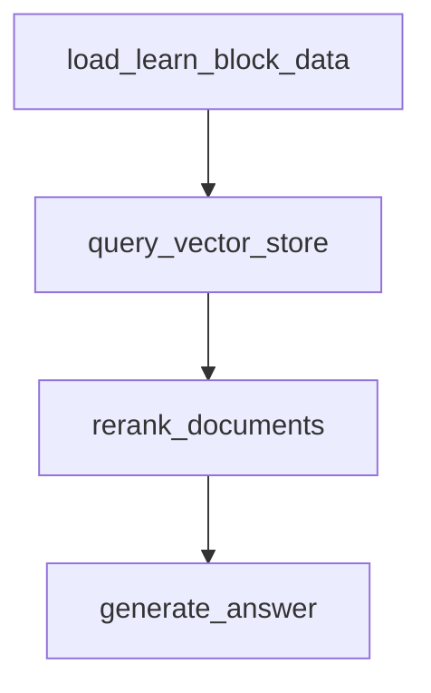
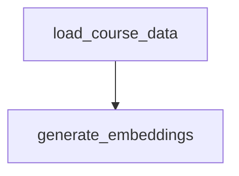
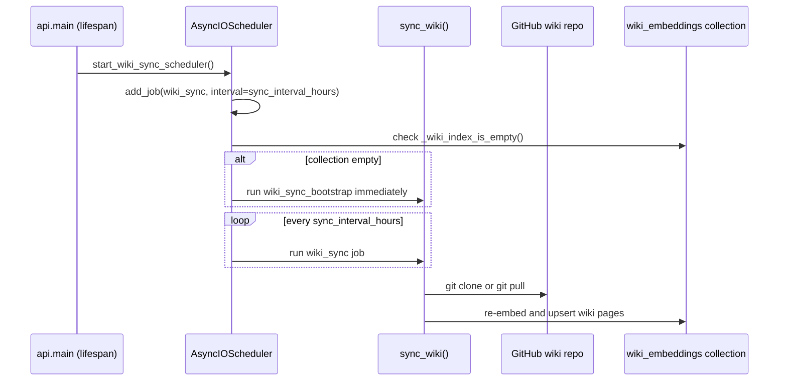
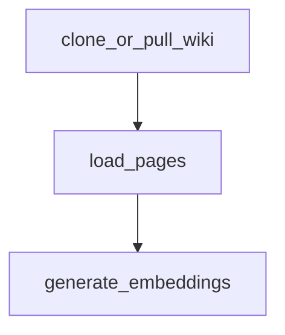
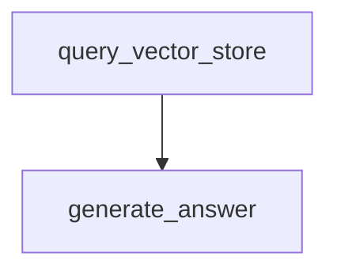

## Overview

This page documents two distinct retrieval-augmented generation (RAG) features that share the same technical building blocks (LangGraph, `langchain-postgres` `PGVector`, OpenAI embeddings) but serve unrelated purposes:

1. **Mentor chat** (`agents/mentor`) — an in-course AI tutor that answers a student's question about the specific `LearnBlock` they are currently studying, grounded in that block's embedded content (`agents/embedding_generator`). Exposed via `POST /agents/learn-blocks-chat` and rendered by the `AiTutorChat` frontend component.
2. **Wiki chat / wiki sync** (`agents/wiki`) — a product feature, unrelated to course content, that periodically clones this repository's own **GitHub wiki** (the `.wiki.git` companion repo, not this `openwiki/` documentation set), embeds its pages, and lets admins ask questions about the project via `POST /agents/wiki-chat`, with manual re-sync via `POST /agents/wiki-sync`.

> **Disambiguation:** "agents/wiki" here is unrelated to the OpenWiki authoring pipeline that generates *this* documentation set (see `AGENTS.md` / `CLAUDE.md`). OpenWiki is a GitHub Actions-driven evidence/documentation generator for `openwiki/*.md` pages; `agents/wiki` is application code that syncs and answers questions about the project's GitHub *wiki* repository (a separate artifact, typically `<repo>.wiki.git`), for the benefit of the product's own admin users. Both happen to use the word "wiki", but they are independent systems with no code or data dependency on each other.

## Mentor chat (in-course RAG tutor)

### Responsibility and entrypoint

`MentorService` (`agents/mentor/service.py`) builds and runs a LangGraph graph to answer a student's `message` about a given `learn_block_id`. It is invoked from `POST /agents/learn-blocks-chat` (`api/src/agents/routers.py`), which:

- Loads the target `LearnBlock`, verifies its course `is_active` and has `status` `approved` or `archived`.
- Calls `check_enrollment(db, user, course, bypass_for_owner=True)` so only enrolled students (or the course owner/superadmin) can chat.
- Runs `MentorService(db, learn_block_id, user_id, message).chat()`.
- Persists the exchange as a `MentorInteractionLog` row and commits it, then returns the answer.

### Graph: load → query → rerank → generate

`agents/mentor/graph.py` wires a 4-node `StateGraph` over `AgentState` (`agents/mentor/state.py`):

*Mentor RAG pipeline: each node enriches `AgentState` before handing off to the next.*

- **`load_learn_block_data`** (`agents/mentor/nodes/load_learn_block_data.py`): looks up the active `LearnBlock` by `learn_id`, derives `course_id`/`module_id` from its module/course relationship (used later as a vector-store metadata filter), and loads the requesting `User`'s `ai_tone` / `ai_expression_level` preferences (falling back to Czech defaults) to steer the answer's tone.
- **`query_vector_store`** (`agents/mentor/nodes/query_vector_store.py`): calls `get_vector_store().similarity_search(query=message, k=10, filter={"course_id":..., "module_id":...})` against the shared `course_embeddings` PGVector collection, scoping retrieval to the current module so answers never leak content from unrelated courses.
- **`rerank_documents`** (`agents/mentor/nodes/rerank.py`): if more than 3 chunks were retrieved, asks an LLM (configurable via `SystemSetting` key `mentor_reranker`, default model `gpt-4o-mini`) to reorder chunk indices by relevance and keeps the top 3; on any parse/LLM failure it falls back to the first 3 original chunks. With ≤3 chunks, reranking is skipped entirely.
- **`generate_answer`** (`agents/mentor/nodes/generate_answer.py`): builds a system+user prompt from the (reranked) chunks, the student's tone/expression-level preferences, and an LLM config from `SystemSetting` key `mentor_answer` (default model `gpt-5-mini`); the default prompt constrains the model to answer only from supplied context, admit gaps, and stay under ~500 characters. Falls back to a Czech apology string on LLM or retrieval failure.

`get_llm_config` / `create_chat_llm` (`agents/base/llm.py`) provide the shared mechanism for both `mentor_reranker` and `mentor_answer`: they load an overridable prompt/model pair from the `SystemSetting` table (falling back to the hardcoded defaults above), then construct a `ChatOpenAI` or `ChatAnthropic` instance based on the model name prefix.

### MentorInteractionLog persistence (auditing)

Every mentor exchange is recorded for audit purposes as a `MentorInteractionLog` row (`api/models.py`), written by the `/agents/learn-blocks-chat` route handler immediately after a successful `MentorService.chat()` call:

- Columns: `log_id` (identity PK), `user_id` (FK → `user.user_id`), `learn_id` (FK → `learn_block.learn_id`), `user_message`, `ai_response`, plus `TimestampMixin`/`SoftDeleteMixin` fields.
- Indexed on `user_id`, `learn_id`, and the `(user_id, learn_id)` pair to support per-user and per-block audit queries.
- One row = one question/answer turn (not one whole conversation), so a chat session produces multiple log rows.
- Superadmin tooling (`api/src/superadmin/controllers.py` → `get_mentor_interaction_logs`, exposed via `api/src/superadmin/routers.py`) lists these logs, optionally filtered by `user_id`, ordered by `created_at` descending, for oversight of what students asked and what the mentor answered.
- The log is only written after a successful chat invocation inside the same request; if `MentorService.chat()` raises, no log row is created for that turn.

### Embedding generation for LearnBlocks

Mentor retrieval depends on `agents/embedding_generator` having previously embedded a course's content. `EmbeddingGeneratorService` (`agents/embedding_generator/service.py`) runs a 2-node graph:

*Course embedding pipeline invoked once a course reaches `approved` status.*

- **`load_course_data`** (`agents/embedding_generator/nodes/load_course_data.py`): fetches the `Course` and asserts it is `is_active` and `status == approved` (raises `ValueError` otherwise — embeddings are only generated for approved courses); then loads all active `LearnBlock`s across the course's active `Module`s, ordered by module/learn_id.
- **`generate_embeddings`** (`agents/embedding_generator/nodes/generate_embeddings.py`): for each `LearnBlock`, splits `content` with `RecursiveCharacterTextSplitter(chunk_size=500, chunk_overlap=100, add_start_index=True)`, wraps each chunk as a `Document` with metadata `{learn_block_id, module_id, course_id, chunk_index}`, and calls `vector_store.add_documents(...)` with deterministic ids `"{learn_block_id}_{idx}"` — re-running generation for the same course overwrites prior chunks for unchanged blocks rather than duplicating them.
- A third node, `save_embeddings_node` (`agents/embedding_generator/nodes/save_embeddings.py`), is present but fully commented out and not wired into the graph; it is dead/legacy code for an alternate design that stored embeddings directly on `LearnBlock` rows instead of in PGVector.
- Triggered via `POST /agents/generate-embeddings?course_id=...` (see `api/src/agents/routers.py`), which independently re-checks the `approved` status before invoking the service, and surfaces `blocks_processed`/`chunks_created` counts. The admin UI exposes this as the `GenerateEmbeddingsButton` component (course review/list views).

### Shared vector store factory

`agents/vector_store.py` exposes `get_vector_store()`, a lazily-initialized module-level singleton `PGVector` bound to collection `course_embeddings`, using `OpenAIEmbeddings(model="text-embedding-3-large")` and the app's Postgres connection string. It is intentionally a singleton to avoid duplicate SQLAlchemy `MetaData` registration of the `langchain_pg_collection`/`langchain_pg_embedding` tables that `langchain-postgres` manages internally (these are pgvector-backed tables shared by all collections, distinguished by `collection_name`).

## Wiki chat & wiki sync (project GitHub wiki assistant)

### Purpose

This is a separate product feature for **admin users** of the platform: it answers questions about the project itself (architecture, decisions, how things work) by retrieving from an embedded copy of the repository's GitHub wiki — not course content, and not the `openwiki/` documentation tree. It has its own PGVector collection (`WIKI_COLLECTION_NAME = "wiki_embeddings"`, `agents/wiki/vector_store.py`) so wiki pages never mix with `course_embeddings`.

### Background sync: APScheduler job

`agents/wiki/agent/scheduler.py` registers and drives a periodic sync using `AsyncIOScheduler` (APScheduler):

- `start_wiki_sync_scheduler()` is called from the FastAPI `lifespan` context manager in `api/main.py` on application startup (and `stop_wiki_sync_scheduler()` on shutdown).
- It schedules job id `wiki_sync` on an `IntervalTrigger(hours=settings.wiki.sync_interval_hours)` — the interval is configured via `WikiSettings.sync_interval_hours` (`api/config.py`, default `12`), part of the app's `Settings.wiki` config block (also holding `repo_url` and `local_path`). `add_job(..., replace_existing=True)` makes repeated calls to `start_wiki_sync_scheduler()` idempotent (e.g. across `uvicorn --reload` restarts).
- Because `IntervalTrigger` only fires *after* a full interval elapses, a fresh environment would otherwise have nothing to answer wiki-chat questions with for the first `sync_interval_hours`. To avoid that, `_wiki_index_is_empty()` checks (via a raw SQL `EXISTS` query joining `langchain_pg_embedding`/`langchain_pg_collection`) whether the `wiki_embeddings` collection has any rows — treating a missing/uninitialized PGVector table the same as "empty" — and if so, immediately enqueues a one-off bootstrap job (`wiki_sync_bootstrap`) so the wiki is indexed right after startup rather than waiting for the first interval tick.

*Startup bootstrap plus recurring interval sync of the project GitHub wiki into pgvector.*

### Sync graph: clone/pull → load pages → embed

`WikiAgentService.sync()` (`agents/wiki/agent/service.py`) runs the `agents/wiki/agent/graph.py` LangGraph over `WikiAgentState` (`repo_url`, `local_path`, `pages`):

*Wiki indexing pipeline: git sync, then markdown load, then chunk + embed.*

- **`clone_or_pull_wiki`** (`agents/wiki/agent/nodes/clone_or_pull_wiki.py`): if `local_path/.git` exists, runs `git pull`; otherwise runs `git clone <repo_url> <local_path>` (creating parent directories first). Both are run via `subprocess.run(..., check=True, capture_output=True)`, so a git failure raises and aborts the sync (surfaced as a failed background job or a 500 from the manual endpoint).
- **`load_pages`** (`agents/wiki/agent/nodes/load_pages.py`): globs all `*.md` files directly under `local_path` (non-recursive) and reads each with the shared `MarkdownLoader` (`agents/base/loaders/markdown.py`), producing `WikiPageData(title=<filename stem>, file_path, content)`.
- **`generate_embeddings`** (`agents/wiki/agent/nodes/generate_embeddings.py`): splits each page with the same `RecursiveCharacterTextSplitter(chunk_size=500, chunk_overlap=100)` settings used for course content, tags each chunk with metadata `{title, file_path, chunk_index}`, and upserts into `get_wiki_vector_store()` with deterministic ids `"{title}_{idx}"` (so re-syncing overwrites rather than duplicates chunks for unchanged pages).
- `WikiSyncResult.pages_processed` reports the number of pages loaded (not chunks), returned to both the scheduler's log line and the manual `/agents/wiki-sync` response.

### Manual sync and chat endpoints

`api/src/agents/routers.py` exposes two routes on top of this pipeline:

- `POST /agents/wiki-sync` — `require_role("superadmin")`-gated; calls `sync_wiki()` directly (same code path as the scheduled job) and returns `WikiSyncResponse(pages_processed, message)`. Used for on-demand re-indexing after larger wiki edits, without waiting for the next interval.
- `POST /agents/wiki-chat` — open to any authenticated caller reaching the route (no explicit role dependency beyond routing); delegates to `WikiChatService(db, message).chat()`.

The admin UI's `WikiSyncView` component (`frontend/src/components/admin/views/WikiSyncView.tsx`, mounted at `frontend/src/app/admin/wiki/page.tsx`) surfaces the manual sync button (visible/enabled only for superadmins via `useRole()`), shows the last browser-local sync result (persisted client-side in `localStorage`, since the backend does not expose sync history), and explains that sync also runs automatically every ~12 hours.

### Wiki mentor graph: query → generate

`WikiChatService` (`agents/wiki/mentor/service.py`) runs a 2-node LangGraph over `WikiMentorState` (`db`, `message`, `context_chunks`, `answer`):

*Wiki chat pipeline: no LearnBlock scoping or reranking step, unlike the course mentor.*

- **`query_vector_store_node`** (`agents/wiki/mentor/nodes/query_vector_store.py`): runs `get_wiki_vector_store().similarity_search(query=message, k=10)` with no metadata filter (there is no per-course/module scoping concept for wiki content).
- **`generate_answer_node`** (`agents/wiki/mentor/nodes/generate_answer.py`): builds a context block labeling each chunk with its source page title, and answers using an LLM configured via `SystemSetting` key `wiki_mentor_answer` (default model `gpt-4o-mini`); the default prompt restricts answers strictly to the retrieved wiki context, requires Czech responses, and asks for brevity. Falls back to an apology string if no chunks were retrieved or the LLM call fails.

Unlike the mentor graph, there is no `load_*` node (no course/module scoping) and no rerank step — the wiki chat pipeline is intentionally simpler.

### Shared wiki vector store factory

`agents/wiki/vector_store.py` mirrors `agents/vector_store.py`'s pattern: a lazily-initialized singleton `PGVector` using the same `OpenAIEmbeddings(model="text-embedding-3-large")` model, but bound to `collection_name="wiki_embeddings"`, explicitly to keep wiki content out of the course collection.

## Configuration reference

| Setting | Location | Default | Effect |
|---|---|---|---|
| `WikiSettings.sync_interval_hours` | `api/config.py` (`Settings.wiki`) | `12` | Interval between scheduled wiki sync runs. |
| `WikiSettings.repo_url` | `api/config.py` | `https://github.com/markuss23/praktik-ai.wiki.git` | GitHub wiki repo cloned/pulled by the sync job. |
| `WikiSettings.local_path` | `api/config.py` | `../wiki_data` | Local checkout path used for `git clone`/`git pull`. |
| `SystemSetting` key `mentor_reranker` | DB-backed via `get_llm_config` | model `gpt-4o-mini` | Overridable reranker model/prompt for mentor chat. |
| `SystemSetting` key `mentor_answer` | DB-backed via `get_llm_config` | model `gpt-5-mini` | Overridable answer-generation model/prompt for mentor chat. |
| `SystemSetting` key `wiki_mentor_answer` | DB-backed via `get_llm_config` | model `gpt-4o-mini` | Overridable answer-generation model/prompt for wiki chat. |

Environment variables can override nested settings using the `__` delimiter (e.g. `WIKI__SYNC_INTERVAL_HOURS`), per `Settings.model_config` (`env_nested_delimiter="__"`).

## Frontend surfaces

- **Mentor**: `AiTutorChat` (`frontend/src/components/admin/AiTutorChat.tsx`) is embedded in the module learning page (`frontend/src/app/(main)/modules/[slug]/page.tsx`) and calls `learnBlocksChat(learnBlockId, message)` (`frontend/src/lib/api-client.ts`), which hits `POST /agents/learn-blocks-chat`. Chat history is persisted per-module in `sessionStorage` for continuity across refreshes. Note: `frontend/src/app/(main)/tutor/page.tsx` is a separate, unimplemented placeholder route and not the mentor chat surface.
- **Wiki chat/sync admin**: `frontend/src/app/admin/wiki/page.tsx` renders `WikiSyncView`, which currently only exposes the manual sync trigger described above; it does not yet render a wiki-chat message UI in the reviewed code.

## Failure and safety notes

- Mentor answers are strictly context-bound by prompt instruction, not by hard filtering — if retrieval finds no chunks for the (course_id, module_id) filter, `generate_answer` short-circuits with a fixed apology instead of calling the LLM.
- Wiki sync failures (git errors, embedding errors) inside the scheduled job are caught and logged (`logger.exception`) so the scheduler keeps running; failures from the manual `/agents/wiki-sync` endpoint instead propagate as an unhandled exception, surfaced by `api/main.py`'s global exception handler as an HTTP 500.
- Embedding generation for courses is gated on `Status.approved`; attempting it on a non-approved course raises a `ValueError` in the graph node (surfaced as HTTP 400 by the route) — this is an invariant the mentor pipeline relies on, since retrieval assumes embeddings exist only for approved course content.
- Because `PGVector` documents use deterministic ids derived from source keys (`{learn_block_id}_{idx}` for courses, `{title}_{idx}` for wiki pages), re-running either embedding pipeline is safe to repeat and acts as an upsert rather than creating duplicate chunks.
